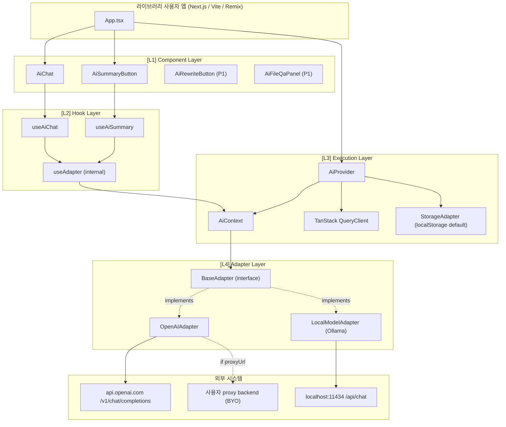
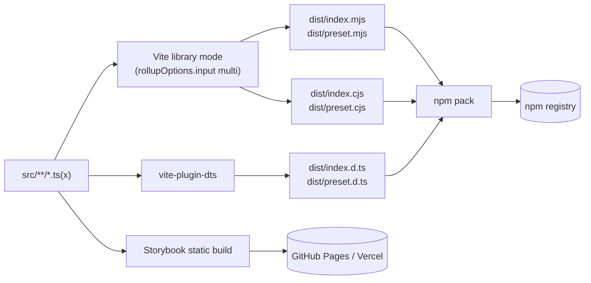
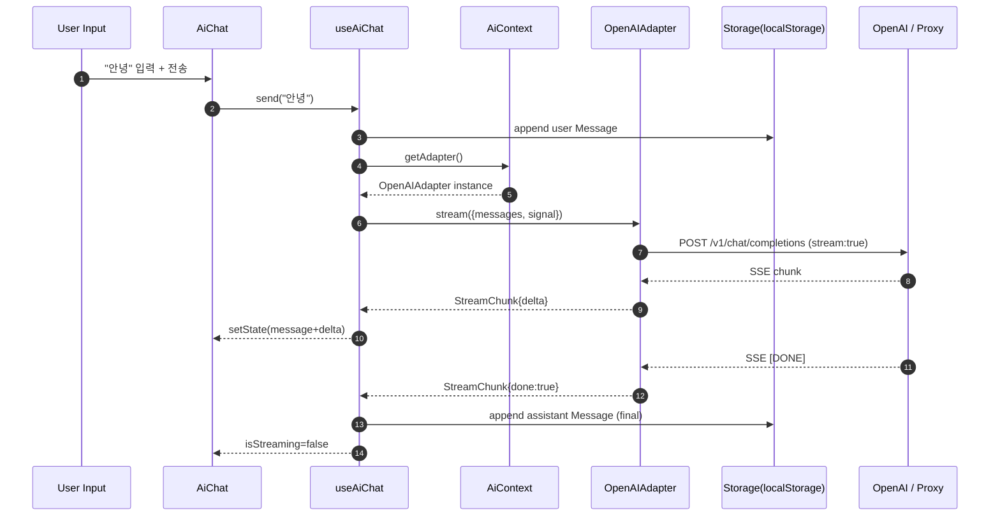
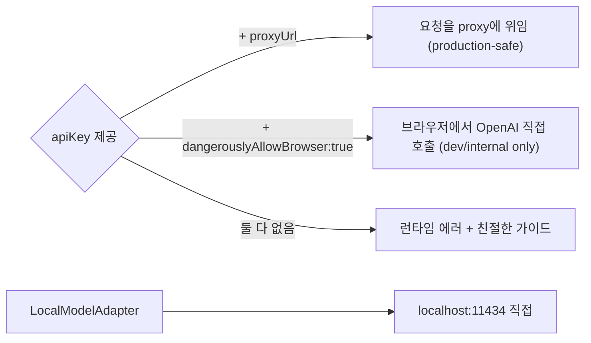

# 01. 아키텍처 (확정본) — `@org/ai-react`

> **한 줄 요약**: 4계층(Component → Hook → Execution → Adapter) 어댑터 패턴 React npm 라이브러리. Vite library mode로 ESM+CJS+`.d.ts` 듀얼 빌드, sideEffects-free, 단일 패키지에 모든 어댑터 포함, Tailwind preset은 서브패스 export.
>
> **상태**: 확정(Confirmed) — 0.1.0 구현 입력
>
> **spec/와의 관계**:
> - `spec/01_prd.md` → 본 문서 §2 FR/§3 NFR로 **그대로 채택** + 우선순위/담당 보강
> - `spec/02_architecture_preview.md` → 본 문서 §4~§7로 **그대로 채택** + 디렉토리 트리/peerDeps/exports/빌드 매트릭스 확정
>
> **참조**: [`./00_input.md`](./00_input.md) · [`./02_api_spec.md`](./02_api_spec.md) · [`./03_db_schema.md`](./03_db_schema.md) · [`../spec/index.md`](../spec/index.md)

---

## 1. 프로젝트 개요

| 항목 | 값 |
|------|-----|
| 프로젝트명 | `@org/ai-react` (npm 패키지) |
| 첫 릴리즈 | `0.1.0` (P0 6종 + Storybook + npm publish) |
| 라이선스 | MIT |
| 종류 | React 컴포넌트 라이브러리(서버 없음) |
| 타깃 사용자 | React 프론트엔드 개발자 / 1인·소규모 프로토타입팀 / 바이브 코더 |
| 규모 | 소규모(라이브러리 단일 패키지). 모노레포 미사용 |

**일반 풀스택과의 차이**: DB·서버·REST 라우팅 표가 없다. 대신 (1) 도메인 TypeScript 타입, (2) Public/External API, (3) localStorage 영속화 스키마, (4) Storybook 카탈로그가 산출물의 중심.

---

## 2. 기능 요구사항 (FR) — spec/01_prd.md 채택

| # | 기능 | 종류 | 우선순위 | spec 참조 |
|---|------|------|---------|----------|
| FR-1 | `AiProvider` engine 디스크리미네이터 + Context 주입 | Component(Provider) | P0 | US-1 |
| FR-2 | `AiChat` 대화형 UI(스트리밍·취소·persist·a11y) | Component(Headless) | P0 | US-2 |
| FR-3 | `AiSummaryButton` 클릭→요약 팝오버 | Component | P0 | US-3 |
| FR-4 | `useAiChat` 상태/제어 Hook | Hook | P0 | US-4 |
| FR-5 | `OpenAIAdapter` Chat Completions SSE + proxy/direct | Adapter | P0 | US-5 |
| FR-6 | `LocalModelAdapter` Ollama `/api/chat` NDJSON | Adapter | P0 | US-6 |
| FR-7 | `AiRewriteButton` (tone preset) | Component | P1 | US-7 |
| FR-8 | `AiFileQaPanel` (PDF/TXT QA) | Component | P1 | US-8 |
| FR-9 | Vision/멀티모달 어댑터 | Adapter | P2 | US-9 |

**보강(_workspace/ 확정 사항)**:
- FR-1의 `dangerouslyAllowBrowser` 검사: production 빌드(`process.env.NODE_ENV === 'production'`)에서 throw, dev에서 `console.warn`. → backend-dev에 위임
- FR-2의 `persist`는 default `true`이며 SSR 환경에서는 자동 비활성(window guard) → backend-dev `LocalStorageAdapter`가 책임

## 3. 비기능 요구사항 (NFR) — spec/01_prd.md 채택

| ID | 항목 | 요구사항 | 검증 방법 |
|----|------|---------|----------|
| NFR-1 | 번들 크기 | core gzip < 15KB, OpenAIAdapter < 8KB, sideEffects:false | size-limit CI |
| NFR-2 | 타입 안전성 | TS strict, discriminated union, `.d.ts` 정상 export | tsc --noEmit, attw |
| NFR-3 | 호환성 | React 18+, Node 18+(dev), ESM+CJS 듀얼 | `npm pack` smoke |
| NFR-4 | 접근성 | role="log", aria-live="polite", 키보드 100% | testing-library + axe |
| NFR-5 | 보안 | direct 모드 `dangerouslyAllowBrowser` 강제 | unit test |
| NFR-6 | 성능 | TTFC < 1.5s, 스트리밍 입력 lag < 16ms | Storybook perf demo |
| NFR-7 | 테스트 | 핵심 어댑터/Hook 커버리지 ≥ 80%, MSW SSE 모킹 | vitest --coverage |
| NFR-8 | 문서 | Storybook 컴포넌트별 stories + MDX | Chromatic 선택 |
| NFR-9 | 라이선스 | MIT, 의존성 호환 검사 | `license-checker` CI |
| NFR-10 | 영속화 | localStorage 기본 + plug-in, SSR 안전 | unit test + SSR smoke |

---

## 4. 시스템 아키텍처 (4-Layer)



**계층 책임 (spec/02 §2 채택)**:

| 계층 | 책임 | 의존 방향 |
|------|------|----------|
| L1 Component | 헤드리스 UI, className 슬롯, data-attribute | → L2 only |
| L2 Hook | 비즈니스 로직(send/stream/cancel), TanStack Query mutation | → L3 |
| L3 Execution | Provider/Context, QueryClient, StorageAdapter 주입 | → L4 |
| L4 Adapter | 외부 LLM 통신, `BaseResponse`/`StreamChunk` 정규화 | → External |

**규칙**:
- L4(Adapter)는 React에 무지(無知). 순수 TS 모듈로 단위테스트 가능
- L1은 L4를 직접 호출하지 않는다. 항상 L2(Hook) 경유
- `useAdapter`는 internal. `index.ts` 배럴에서 export하지 않음

---

## 5. 디렉토리 구조 (확정)

```
@org/ai-react/
├─ src/
│  ├─ index.ts                       # public exports (배럴)
│  ├─ provider/
│  │  ├─ AiProvider.tsx              # Context.Provider + queryClient/storage 주입
│  │  └─ AiContext.ts                # createContext + useAdapter (internal)
│  ├─ components/
│  │  ├─ AiChat/
│  │  │  ├─ AiChat.tsx
│  │  │  ├─ AiChat.stories.tsx
│  │  │  ├─ AiChat.mdx
│  │  │  ├─ AiChat.test.tsx
│  │  │  └─ parts/
│  │  │     ├─ MessageList.tsx
│  │  │     ├─ MessageItem.tsx
│  │  │     └─ Composer.tsx
│  │  ├─ AiSummaryButton/
│  │  │  ├─ AiSummaryButton.tsx
│  │  │  ├─ AiSummaryButton.stories.tsx
│  │  │  ├─ AiSummaryButton.mdx
│  │  │  ├─ AiSummaryButton.test.tsx
│  │  │  └─ parts/
│  │  │     └─ Popover.tsx
│  │  ├─ AiRewriteButton/            # P1 (0.2.0)
│  │  └─ AiFileQaPanel/              # P1 (0.2.0)
│  ├─ hooks/
│  │  ├─ index.ts
│  │  ├─ useAiChat.ts
│  │  ├─ useAiSummary.ts
│  │  ├─ useAdapter.ts               # internal
│  │  └─ __tests__/
│  ├─ adapters/
│  │  ├─ index.ts
│  │  ├─ BaseAdapter.ts              # interface
│  │  ├─ OpenAIAdapter.ts
│  │  ├─ LocalModelAdapter.ts
│  │  ├─ parsers/
│  │  │  ├─ parseSSE.ts              # OpenAI SSE 파서
│  │  │  └─ parseNdjson.ts           # Ollama NDJSON 파서
│  │  ├─ errors.ts                   # AuthError/RateLimitError/etc.
│  │  └─ __tests__/
│  ├─ storage/
│  │  ├─ index.ts
│  │  ├─ StorageAdapter.ts           # interface
│  │  ├─ LocalStorageAdapter.ts      # SSR-safe, debounced write
│  │  ├─ MemoryStorageAdapter.ts
│  │  ├─ keys.ts                     # `aireact:v1:*` 키 빌더
│  │  ├─ migrate.ts                  # schemaVersion 마이그레이션
│  │  └─ __tests__/
│  ├─ types/
│  │  ├─ index.ts                    # re-export
│  │  ├─ message.ts
│  │  ├─ adapter.ts
│  │  ├─ stream.ts
│  │  └─ config.ts                   # OpenAIConfig / LocalConfig
│  └─ preset/
│     └─ tailwind.ts                 # @org/ai-react/preset
├─ stories/
│  ├─ 0-Introduction.mdx
│  ├─ 1-QuickStart.mdx
│  └─ Patterns/
│     ├─ HeadlessCustomization.mdx
│     ├─ ProxyVsDirect.mdx
│     └─ StorageAdapters.mdx
├─ .storybook/
│  ├─ main.ts                        # storyStoreV7, vite framework
│  └─ preview.tsx                    # AiProvider mock + MSW handlers
├─ test/
│  ├─ setup.ts                       # vitest setup (msw, RTL)
│  └─ msw/
│     ├─ openai.ts                   # SSE drip handler
│     └─ ollama.ts                   # NDJSON drip handler
├─ vite.config.ts
├─ vitest.config.ts
├─ tsconfig.json                     # strict
├─ tsconfig.build.json
├─ size-limit.config.cjs
├─ package.json
├─ README.md
├─ LICENSE                           # MIT
├─ CHANGELOG.md
└─ CONTRIBUTING.md
```

---

## 6. peerDependencies 정책 (확정)

```jsonc
// package.json (발췌)
{
  "name": "@org/ai-react",
  "version": "0.1.0",
  "type": "module",
  "license": "MIT",
  "sideEffects": false,
  "peerDependencies": {
    "react": "^18.0.0 || ^19.0.0",
    "react-dom": "^18.0.0 || ^19.0.0",
    "@tanstack/react-query": "^5.0.0"
  },
  "peerDependenciesMeta": {
    "@tanstack/react-query": { "optional": false }
  },
  "dependencies": {
    "nanoid": "^5.0.0"
  },
  "devDependencies": {
    "vite": "^5.0.0",
    "vite-plugin-dts": "^4.0.0",
    "typescript": "^5.4.0",
    "vitest": "^2.0.0",
    "@testing-library/react": "^16.0.0",
    "msw": "^2.0.0",
    "size-limit": "^11.0.0",
    "@size-limit/preset-small-lib": "^11.0.0",
    "tailwindcss": "^3.4.0"
  }
}
```

**결정 사유**:
- `@tanstack/react-query`는 **필수 peer**(optional:false). 사용자 환경에 흔하고, 미설치 시 친절한 에러 throw가 더 명확. `[TBD]`(spec/02 §10) 결론 = 필수 채택
- `nanoid`는 ULID 대신 채택(번들 < 1KB). `Message.id` 생성에 사용
- `tailwindcss`는 dev 전용. preset import는 사용자 환경의 tailwind를 참조

---

## 7. Vite 빌드 토폴로지



**`vite.config.ts` 핵심**:

```ts
import { defineConfig } from 'vite';
import react from '@vitejs/plugin-react';
import dts from 'vite-plugin-dts';
import { resolve } from 'node:path';

export default defineConfig({
  plugins: [react(), dts({ rollupTypes: true, include: ['src/**/*'] })],
  build: {
    lib: {
      entry: {
        index: resolve(__dirname, 'src/index.ts'),
        preset: resolve(__dirname, 'src/preset/tailwind.ts'),
      },
      formats: ['es', 'cjs'],
      fileName: (fmt, name) => `${name}.${fmt === 'es' ? 'mjs' : 'cjs'}`,
    },
    rollupOptions: {
      external: ['react', 'react-dom', 'react/jsx-runtime', '@tanstack/react-query'],
      output: {
        globals: { react: 'React', 'react-dom': 'ReactDOM' },
      },
    },
    sourcemap: true,
    target: 'es2020',
  },
});
```

---

## 8. `package.json` exports / sideEffects (초안)

```jsonc
{
  "main": "./dist/index.cjs",
  "module": "./dist/index.mjs",
  "types": "./dist/index.d.ts",
  "exports": {
    ".": {
      "types": "./dist/index.d.ts",
      "import": "./dist/index.mjs",
      "require": "./dist/index.cjs"
    },
    "./preset": {
      "types": "./dist/preset.d.ts",
      "import": "./dist/preset.mjs",
      "require": "./dist/preset.cjs"
    },
    "./package.json": "./package.json"
  },
  "files": ["dist", "README.md", "LICENSE", "CHANGELOG.md"],
  "sideEffects": false,
  "publishConfig": { "access": "public", "provenance": true }
}
```

**deep import 정책 (확정)**:
- `./adapters/openai`, `./adapters/local`은 0.1.0에서 **export하지 않는다**. 트리셰이킹으로 충분(spec/02 §7 [TBD] 해소)
- 0.2.0 이후 사용자 요구가 있을 시 검토

---

## 9. 빌드 산출물 매트릭스

| 산출물 | 경로 | 포맷 | 소비자 | 검증 |
|--------|------|------|-------|------|
| 메인 ESM | `dist/index.mjs` | ES2020 | Vite/Next.js/Remix | size-limit, attw |
| 메인 CJS | `dist/index.cjs` | CommonJS | Node 레거시, Jest | size-limit |
| 메인 타입 | `dist/index.d.ts` | TypeScript | IDE/타입체커 | tsc --noEmit |
| Preset ESM | `dist/preset.mjs` | ES2020 | tailwind.config.* | smoke import |
| Preset CJS | `dist/preset.cjs` | CommonJS | tailwind.config.cjs | smoke import |
| Preset 타입 | `dist/preset.d.ts` | TypeScript | tailwind.config.ts | tsc |
| Storybook | `storybook-static/` | HTML/JS | GitHub Pages/Vercel | playwright smoke (선택) |

**size-limit 목표 (NFR-1)**:
- `dist/index.mjs` (Provider + useAiChat + Message 타입만) gzip < 15KB
- `dist/index.mjs` + OpenAIAdapter 트리셰이킹 후 gzip < 23KB
- `dist/index.mjs` + LocalModelAdapter 트리셰이킹 후 gzip < 22KB

---

## 10. 데이터 흐름 (채팅 1회 — spec/02 §3 채택)



---

## 11. 보안 모델 (spec/02 §5 채택)



**검증 규칙 (확정)**:
1. `engine === 'openai'` && `apiKey` 있음 && `proxyUrl` 없음 && `dangerouslyAllowBrowser !== true` → throw `Error("Refusing to send apiKey from browser. Set proxyUrl or dangerouslyAllowBrowser:true.")`
2. `engine === 'openai'` && `apiKey` 없음 && `proxyUrl` 없음 → dev에서 `console.warn`, production 빌드(`process.env.NODE_ENV === 'production'`)에서 throw
3. `engine === 'local'`은 LocalConfig 검증만 (apiKey 무관)

---

## 12. 확장 시나리오 (spec/02 §8 채택)

- **새 어댑터(Claude)**: `src/adapters/ClaudeAdapter.ts` 추가 + `engine` 디스크리미네이터 확장. UI 코드 변경 0줄
- **새 모달리티(Vision)**: `Message.content`는 이미 `string | ContentPart[]` union. 신규 컴포넌트만 추가
- **영속화 교체**: `<AiProvider storage={new IndexedDBStorageAdapter()}>` — 인터페이스 만족하면 즉시 동작

---

## 13. Open Questions (구현 차단 여부 표기)

| 항목 | 출처 | 0.1.0 차단? | 결정 |
|------|------|------------|------|
| TanStack Query peer 강제 여부 | spec/02 §10 | No | **필수 peer로 확정**(§6) |
| AbortController 노출 범위 | spec/02 §10 | No | `useAiChat.cancel()` API만 노출, raw signal은 비공개 |
| RSC 호환 가이드 | spec/02 §10 | No | 0.3.0에서 검토. `'use client'` 가이드 README 한 줄 추가 |
| Responses API 마이그레이션 | spec/03 §D | No | 0.x에서 minor breaking 허용 명시(CHANGELOG) |
| 멀티모달 타입 0.1.0 포함 | spec/03 §D | No | `ContentPart[]` union은 타입 정의에 포함, 컴포넌트 처리는 P2 |
| proxy envelope 표준화 | spec/03 §D | **Yes** | **OpenAI 호환 스키마 가정**(같은 body·헤더). 자체 envelope는 0.2.0 |
| 토큰 telemetry 노출 | spec/01 §8 | No | `useAiChat`의 `onComplete(message, usage?)` 두 번째 인자로 노출 |
| 마크다운 렌더러 내장 | spec/01 §8 | No | 미내장. `renderMessage` render-prop으로 사용자 결정 |
| 멀티 세션 UI | spec/04 §7 | No | 0.1.0은 단일 sessionId, prop으로 변경 가능 |
| TokenUsage 영속화 | spec/04 §7 | No | 메모리만, 영속화는 0.2.0 |

---

## 14. 팀 전달 사항

### 14.1 frontend-dev에게
- **컴포넌트 구조**: 모든 컴포넌트는 헤드리스 + className 슬롯(`classNames.{root,list,message,composer}`) + `data-state`/`data-role` 속성. 시각 스타일은 컴포넌트 코드에 박지 말 것
- **Hook**: `useAiChat`은 TanStack Query `useMutation`으로 stream 시작, 내부 reducer로 messages 누적. `cancel()`은 `AbortController.abort()` + mutation reset
- **Provider**: `AiProvider`는 (1) `useMemo`로 어댑터 인스턴스 생성, (2) 외부 `queryClient` 미주입 시 자체 생성, (3) `storage` 미주입 시 `LocalStorageAdapter` 자동 주입, (4) §11의 보안 검증을 effect에서 실행
- **a11y**: AiChat 메시지 리스트는 `role="log" aria-live="polite" aria-atomic="false"`. Composer textarea `aria-label`. 키보드: Enter=send, Shift+Enter=newline, ESC=cancel
- **렌더 최적화**: 스트리밍 중 last message만 mutable 업데이트(전체 배열 새 참조 1번/16ms 미만)
- **Storybook**: 컴포넌트당 `Default/Empty/Streaming/Error/Custom` 5종 + MDX. MSW로 OpenAI/Ollama 모킹(`test/msw/*` 재사용)

### 14.2 backend-dev에게
> 이 프로젝트의 backend-dev는 **어댑터/스토리지/파서 담당**. 서버 없음.
- **OpenAIAdapter**: `proxyUrl` 우선, 없으면 `apiKey + dangerouslyAllowBrowser` 검증 후 `https://api.openai.com/v1/chat/completions`. SSE 파서는 `parseSSE` 유틸로 분리(테스트 용이)
- **LocalModelAdapter**: `${baseUrl}/api/chat`(default `http://localhost:11434`). NDJSON 라인 파서는 `parseNdjson` 유틸 분리. ECONNREFUSED 시 `LocalEngineUnavailable` 에러
- **에러 클래스**: `AuthError`, `RateLimitError`(retryAfter), `UpstreamError`(status,body), `NetworkError`, `LocalEngineUnavailable`, `AbortError`(전파). 모두 `src/adapters/errors.ts`
- **재시도**: 429만 1회 exponential backoff(jitter 250~500ms). 그 외는 즉시 throw
- **StorageAdapter**: `LocalStorageAdapter`는 (1) SSR window guard, (2) write debounce 500ms, (3) 키 prefix `aireact:v1:`. 키 빌더는 `storage/keys.ts`로 분리
- **마이그레이션**: `schemaVersion` mismatch 시 best-effort 변환 + 백업 키(`aireact:v1:backup:{ts}`) 보관

### 14.3 qa-engineer에게
- **단위 테스트 우선순위**: (1) `parseSSE`/`parseNdjson` 파서, (2) 어댑터(MSW로 chunk drip), (3) `useAiChat` 상태 머신, (4) Provider 보안 검증
- **MSW handler**: `test/msw/openai.ts` (SSE drip), `test/msw/ollama.ts` (NDJSON drip). 키 없이 통과
- **a11y**: testing-library + axe로 AiChat/AiSummaryButton 검증. 키보드 시나리오 테스트(Enter/Shift+Enter/ESC)
- **size-limit**: §9 매트릭스를 `size-limit.config.cjs`로. CI에서 PR 차단
- **커버리지**: ≥ 80%. `parseSSE`/`parseNdjson`/어댑터/`useAiChat`을 우선

### 14.4 devops-engineer에게
- **CI matrix**: Node 18/20/22, React 18/19. lint → typecheck → test → build → size-limit → pack-smoke 순
- **Storybook 호스팅**: `storybook-static/`을 GitHub Pages 또는 Vercel로 배포. PR마다 preview deploy
- **npm publish**: `npm publish --provenance` (OIDC), `prepublishOnly`에 build+test+pack-smoke. semantic-release는 0.2.0에서 검토
- **`exports` 검증**: `@arethetypeswrong/cli` (attw) 사용. CI에 포함
- **release artifact**: `npm pack`을 PR마다 dry-run + tarball 첨부

---

## 15. 가정·트레이드오프 (spec/02 §9 채택)

| 결정 | 대안 | 채택 사유 |
|------|------|----------|
| 단일 패키지 | 코어+어댑터 분리 모노레포 | 0.x는 트리셰이킹으로 충분, 모노레포 운영 비용 회피 |
| Vite library mode | tsup, rollup | Storybook도 Vite → 도구체인 단일화 |
| Headless + Tailwind preset | Tailwind 강제, CSS-in-JS | 디자인 시스템 통합 자유도 + 의존성 최소화 |
| localStorage 기본 | 메모리 only, controlled only | "백엔드 지식 0" 사용자 zero-config |
| TanStack Query 필수 peer | optional / 자체 reducer | 스트리밍/cancel/캐시 표준화, 미설치 시 친절 에러 |
| `nanoid` 채택 | `ulid`, `crypto.randomUUID()` | 번들 < 1KB, brower 호환 |
