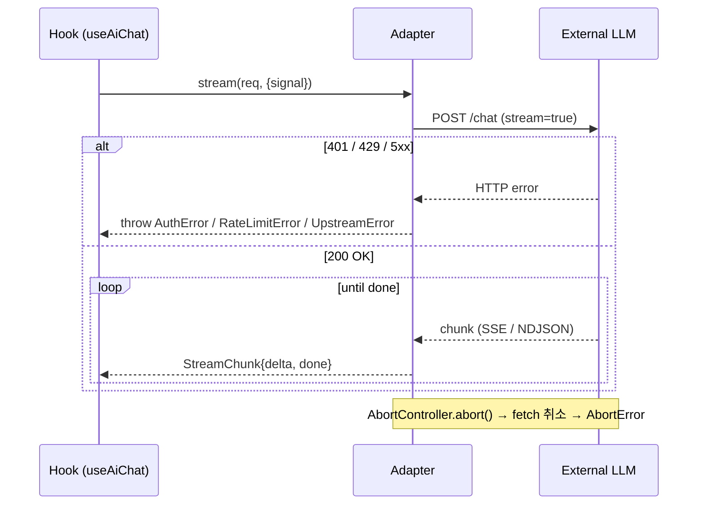
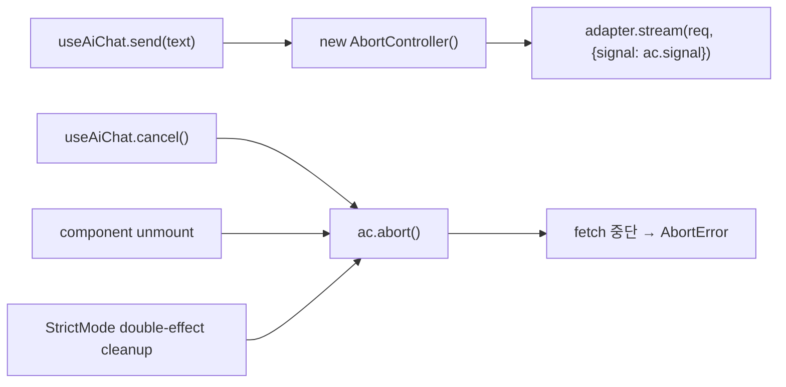

# 02. API 명세 (확정본) — `@org/ai-react`

> **한 줄 요약**: 라이브러리 API는 두 축이다. (A) **Public API** — 사용자가 import하는 컴포넌트 props·Hook 시그니처·Adapter 인터페이스 (TypeScript). (B) **External API** — 어댑터가 OpenAI(SSE)·Ollama(NDJSON)와 통신하는 프로토콜 + proxy envelope.
>
> **상태**: 확정(Confirmed) — 0.1.0 구현 입력
>
> **spec/와의 관계**:
> - `spec/03_api_preview.md` Public/External API → 본 문서 §A/§B로 **그대로 채택** + 컴파일 가능한 TS 타입 + 에러 매핑 표 + AbortController 정책 + a11y 키 매핑 보강
> - `spec/01_prd.md` 수락 기준 → §A 시그니처가 모두 만족
>
> **참조**: [`./01_architecture.md`](./01_architecture.md) · [`./03_db_schema.md`](./03_db_schema.md) · [`../spec/03_api_preview.md`](../spec/03_api_preview.md)

---

## A. Public API (라이브러리 사용자)

### A.0 진입점 — `src/index.ts` 배럴

```ts
// src/index.ts
export { AiProvider } from './provider/AiProvider';
export { AiChat } from './components/AiChat/AiChat';
export { AiSummaryButton } from './components/AiSummaryButton/AiSummaryButton';
// P1
// export { AiRewriteButton } from './components/AiRewriteButton/AiRewriteButton';
// export { AiFileQaPanel } from './components/AiFileQaPanel/AiFileQaPanel';

export { useAiChat } from './hooks/useAiChat';
export { useAiSummary } from './hooks/useAiSummary';

export { OpenAIAdapter } from './adapters/OpenAIAdapter';
export { LocalModelAdapter } from './adapters/LocalModelAdapter';
export { localStorageAdapter, memoryStorageAdapter } from './storage';

export type {
  Message,
  Role,
  ContentPart,
  StreamChunk,
  BaseResponse,
  TokenUsage,
  Adapter,
  ChatRequest,
  Engine,
  EngineConfig,
  OpenAIConfig,
  LocalConfig,
  ChatSession,
  StorageAdapter,
} from './types';

export {
  AiError,
  AuthError,
  RateLimitError,
  UpstreamError,
  NetworkError,
  LocalEngineUnavailable,
  AbortError,
} from './adapters/errors';
```

### A.1 `<AiProvider>` — Context 주입

```ts
import type { ReactNode } from 'react';
import type { QueryClient } from '@tanstack/react-query';
import type { StorageAdapter } from '../storage';

export interface OpenAIConfig {
  /** Direct call 모드에서만 의미. proxyUrl이 있으면 무시되거나 헤더 미설정. */
  apiKey?: string;
  /** 권장. 사용자 백엔드가 OpenAI 호환 envelope을 받아 위임. */
  proxyUrl?: string;
  /** Direct 모드 명시적 opt-in. apiKey + 미지정 = throw. */
  dangerouslyAllowBrowser?: boolean;
  /** default: 'gpt-4o-mini' */
  model?: string;
  /** default: 0.7 */
  temperature?: number;
  maxTokens?: number;
  /** proxy 인증 헤더 등에 사용 */
  headers?: Record<string, string>;
}

export interface LocalConfig {
  /** default: 'http://localhost:11434' */
  baseUrl?: string;
  /** Ollama model tag (e.g. 'llama3', 'qwen2.5:7b'). 필수 */
  model: string;
  temperature?: number;
  /** Ollama keep_alive (e.g. '5m') */
  keepAlive?: string;
}

export type AiProviderProps =
  | {
      engine: 'openai';
      config: OpenAIConfig;
      storage?: StorageAdapter;
      queryClient?: QueryClient;
      children: ReactNode;
    }
  | {
      engine: 'local';
      config: LocalConfig;
      storage?: StorageAdapter;
      queryClient?: QueryClient;
      children: ReactNode;
    };

export declare function AiProvider(props: AiProviderProps): JSX.Element;
```

**런타임 검증 (확정)**:

| 조건 | 동작 |
|------|------|
| `engine: 'openai'`, `apiKey` set, `proxyUrl` unset, `dangerouslyAllowBrowser !== true` | **throw** `AuthError("Refusing to send apiKey from browser. Set proxyUrl or dangerouslyAllowBrowser:true.")` |
| `engine: 'openai'`, `apiKey` unset, `proxyUrl` unset | dev: `console.warn`, production(`process.env.NODE_ENV === 'production'`): **throw** |
| `engine: 'openai'`, `proxyUrl` set | OK. `Authorization` 헤더 미설정 |
| `engine: 'local'`, `model` unset | **throw** `Error("LocalConfig.model is required")` |
| Provider 외부에서 Hook 사용 | **throw** `Error("useAiChat must be used inside <AiProvider>")` |

### A.2 `<AiChat>` — 헤드리스 채팅 UI

```ts
import type { ReactNode } from 'react';
import type { Message } from '../types';

export interface AiChatProps {
  // ── 데이터
  initialMessages?: Message[];
  systemPrompt?: string;

  // ── 영속화
  /** localStorage key: `aireact:v1:session:{sessionId}`. default: 'default' */
  sessionId?: string;
  /** default: true. SSR(window 없음)에서는 자동 false */
  persist?: boolean;

  // ── UX 슬롯
  placeholder?: string;
  emptyState?: ReactNode;
  /** 메시지 렌더링을 사용자가 결정 (마크다운 등) */
  renderMessage?: (m: Message) => ReactNode;
  /** 입력창 자체를 교체 */
  composerSlot?: ReactNode;

  // ── 콜백
  onMessageSent?: (m: Message) => void;
  onComplete?: (m: Message) => void;
  onError?: (e: Error) => void;

  // ── 스타일링
  className?: string;
  classNames?: {
    root?: string;
    list?: string;
    message?: string;
    composer?: string;
  };

  // ── 한도
  /** 영속화 한도. 초과 시 앞에서 잘라 보관. default: 100 */
  maxMessages?: number;
}

export declare function AiChat(props: AiChatProps): JSX.Element;
```

**Data attributes (스타일 hook)**:
- 루트: `data-state="idle" | "streaming" | "error"`
- 메시지: `data-role="user" | "assistant" | "system"`, `data-status="pending" | "streaming" | "complete" | "error"`
- 스트리밍 중인 마지막 메시지: `data-streaming="true"`

### A.3 `<AiSummaryButton>`

```ts
export interface AiSummaryButtonProps {
  input: string;
  /** default: '다음 텍스트를 3줄로 요약해줘.' */
  prompt?: string;
  trigger?: 'click' | 'hover' | 'manual';
  /** render-prop. 미지정 시 기본 팝오버 사용 */
  render?: (s: { result: string; loading: boolean; error?: Error }) => ReactNode;
  onResult?: (result: string) => void;
  className?: string;
  /** 버튼 라벨. 미지정 시 '✨ 요약하기' */
  children?: ReactNode;
}

export declare function AiSummaryButton(props: AiSummaryButtonProps): JSX.Element;
```

**동작 규칙**:
- `input === ''` → 버튼 disabled, `data-state="disabled"`
- in-flight 중 재클릭 → 무시(중복 호출 방지)
- 성공 시 default render는 `Popover` 자식 컴포넌트로 결과 표시 + `[복사][다시 요약]` 버튼

### A.4 `<AiRewriteButton>` (P1, 0.2.0)

```ts
export type RewriteTone = 'formal' | 'casual' | 'concise' | 'friendly' | 'professional';

export interface AiRewriteButtonProps {
  input: string;
  tone?: RewriteTone;
  /** tone과 함께 또는 단독 사용 */
  customPrompt?: string;
  onResult?: (rewritten: string) => void;
  render?: (s: { result?: string; loading: boolean; error?: Error }) => ReactNode;
}
```

### A.5 `<AiFileQaPanel>` (P1, 0.2.0)

```ts
export type RetrievalStrategy = 'client-embedding' | 'chunk-and-prompt';

export interface AiFileQaPanelProps {
  /** default: '.pdf,.txt' */
  accept?: string;
  /** bytes. default: 4 * 1024 * 1024 (4MB) */
  maxFileSize?: number;
  retrieval?: RetrievalStrategy;       // [TBD: 0.2.0 진입 시 결정]
  onUpload?: (doc: import('../types').Document) => void;
  onAnswer?: (q: string, a: string) => void;
}
```

### A.6 Hooks

```ts
// useAiChat — 채팅 상태/제어
export interface UseAiChatOptions {
  sessionId?: string;
  systemPrompt?: string;
  initialMessages?: Message[];
  persist?: boolean;
  maxMessages?: number;
  onChunk?: (c: StreamChunk) => void;
  onComplete?: (m: Message, usage?: TokenUsage) => void;
  onError?: (e: Error) => void;
}

export interface UseAiChatReturn {
  messages: Message[];
  send: (text: string) => Promise<void>;
  cancel: () => void;
  clear: () => void;
  isStreaming: boolean;
  error: Error | null;
}

export declare function useAiChat(opts?: UseAiChatOptions): UseAiChatReturn;

// useAiSummary — 단일 요약
export interface UseAiSummaryOptions {
  prompt?: string;
}

export interface UseAiSummaryReturn {
  summarize: (input: string) => Promise<string>;
  loading: boolean;
  error: Error | null;
  result: string | null;
}

export declare function useAiSummary(opts?: UseAiSummaryOptions): UseAiSummaryReturn;
```

**불변식**:
- `useAiChat` Strict Mode에서 이중 effect 안전 (mutation은 cleanup에서 abort, persist는 idempotent)
- `send` 호출은 in-flight면 즉시 reject (`Error("Already streaming. Call cancel() first.")`)
- `cancel`은 in-flight 없으면 no-op

### A.7 Adapter 인터페이스

```ts
export interface ChatRequest {
  messages: Message[];
  systemPrompt?: string;
  model?: string;
  temperature?: number;
  maxTokens?: number;
  metadata?: Record<string, unknown>;
}

export interface AdapterStreamOptions {
  signal?: AbortSignal;
}

export interface Adapter {
  readonly id: string;            // 'openai' | 'local' | future ids
  chat(req: ChatRequest, opts?: AdapterStreamOptions): Promise<BaseResponse>;
  stream(req: ChatRequest, opts?: AdapterStreamOptions): AsyncIterable<StreamChunk>;
}

// 어댑터 생성 (사용자가 직접 주입할 일은 거의 없음. AiProvider가 처리)
export declare class OpenAIAdapter implements Adapter {
  readonly id: 'openai';
  constructor(config: OpenAIConfig);
  chat(req: ChatRequest, opts?: AdapterStreamOptions): Promise<BaseResponse>;
  stream(req: ChatRequest, opts?: AdapterStreamOptions): AsyncIterable<StreamChunk>;
}

export declare class LocalModelAdapter implements Adapter {
  readonly id: 'local';
  constructor(config: LocalConfig);
  chat(req: ChatRequest, opts?: AdapterStreamOptions): Promise<BaseResponse>;
  stream(req: ChatRequest, opts?: AdapterStreamOptions): AsyncIterable<StreamChunk>;
}
```

### A.8 StorageAdapter (Plug-in)

```ts
export interface StorageAdapter {
  get<T>(key: string): Promise<T | null>;
  set<T>(key: string, value: T): Promise<void>;
  remove(key: string): Promise<void>;
  /** Optional: 같은 prefix를 가진 모든 키 반환 (인덱스 용) */
  keys?(prefix?: string): Promise<string[]>;
}

// 기본 인스턴스 export
export const localStorageAdapter: StorageAdapter;
export const memoryStorageAdapter: StorageAdapter;
```

### A.9 Engine / Config 디스크리미네이터

```ts
export type Engine = 'openai' | 'local';

export type EngineConfig =
  | { engine: 'openai'; config: OpenAIConfig }
  | { engine: 'local'; config: LocalConfig };
```

---

## B. External API (어댑터 ↔ 외부 LLM)

### B.1 OpenAI — Chat Completions Streaming

**Endpoint**:
- Direct: `POST https://api.openai.com/v1/chat/completions`
- Proxy: `POST {proxyUrl}` (사용자 백엔드가 동일 envelope 수신·위임)

**Request Body** (OpenAI 공식 호환):
```json
{
  "model": "gpt-4o-mini",
  "messages": [
    { "role": "system", "content": "..." },
    { "role": "user",   "content": "안녕" }
  ],
  "temperature": 0.7,
  "max_tokens": null,
  "stream": true
}
```

**Headers**:
| 모드 | 헤더 |
|------|------|
| Direct | `Authorization: Bearer {apiKey}`, `Content-Type: application/json`, `...config.headers` |
| Proxy | `Content-Type: application/json`, `...config.headers` (사용자 인증 헤더 사용자가 주입) |

**SSE Response** (한 chunk 예):
```
data: {"id":"chatcmpl-...","choices":[{"index":0,"delta":{"content":"안"},"finish_reason":null}]}

data: {"id":"chatcmpl-...","choices":[{"index":0,"delta":{"content":"녕"},"finish_reason":null}]}

data: {"id":"chatcmpl-...","choices":[{"index":0,"delta":{},"finish_reason":"stop"}]}

data: [DONE]
```

**`parseSSE` 정규화 규칙** (`src/adapters/parsers/parseSSE.ts`):
1. `\n\n`로 event 분리, 각 event 내 `data: ` 라인 추출
2. `data: [DONE]` → 즉시 `StreamChunk { delta: '', done: true, finishReason: lastFinishReason ?? 'stop' }` emit 후 종료
3. 그 외 JSON 파싱 → `delta = choices[0].delta.content ?? ''`
4. `delta`가 빈 문자열이고 `finish_reason`이 있으면 `done: false`로 두고 다음 event 대기 (마지막 event에 `[DONE]` 도착)
5. JSON 파싱 실패 시 → 해당 event skip, `console.debug`만 (어댑터는 throw 안 함)

### B.2 Proxy Envelope (확정)

> spec/03 §D의 `[TBD: proxy envelope 표준화]` 해소.

**0.1.0 결정**: **OpenAI Chat Completions와 100% 동일 envelope**.
- 사용자 백엔드는 동일 body를 받아 OpenAI에 forward (또는 호환 변환). 응답은 동일 SSE stream을 그대로 pipe.
- 라이브러리는 `proxyUrl`을 받으면 `apiKey` 헤더를 **설정하지 않는다**. 사용자가 `headers` prop으로 자체 인증 헤더 주입.
- 0.2.0에서 `proxyEnvelope: 'openai' | 'custom'` 옵션 검토.

**예시 — Express 프록시**:
```ts
// 사용자 backend (참고용, 라이브러리 외부)
app.post('/api/ai', async (req, res) => {
  const r = await fetch('https://api.openai.com/v1/chat/completions', {
    method: 'POST',
    headers: { Authorization: `Bearer ${process.env.OPENAI_KEY}`, 'Content-Type': 'application/json' },
    body: JSON.stringify(req.body),
  });
  res.setHeader('Content-Type', 'text/event-stream');
  r.body!.pipe(res);
});
```

### B.3 Ollama — `/api/chat` NDJSON Streaming

**Endpoint**: `POST {baseUrl}/api/chat` (default `http://localhost:11434/api/chat`)

**Request Body**:
```json
{
  "model": "llama3",
  "messages": [{ "role": "user", "content": "안녕" }],
  "stream": true,
  "options": { "temperature": 0.7 },
  "keep_alive": "5m"
}
```

**NDJSON Response** (라인 단위):
```
{"model":"llama3","created_at":"...","message":{"role":"assistant","content":"안"},"done":false}
{"model":"llama3","created_at":"...","message":{"role":"assistant","content":"녕"},"done":false}
{"model":"llama3","created_at":"...","done":true,"total_duration":123456789,"prompt_eval_count":5,"eval_count":12}
```

**`parseNdjson` 정규화 규칙** (`src/adapters/parsers/parseNdjson.ts`):
1. `\n`으로 라인 분리, 빈 라인 skip
2. JSON 파싱 → `delta = obj.message?.content ?? ''`, `done = obj.done === true`
3. `done: true` 라인의 `prompt_eval_count`/`eval_count`를 `TokenUsage`로 매핑:
   ```ts
   { promptTokens: obj.prompt_eval_count, completionTokens: obj.eval_count, totalTokens: (a+b) }
   ```
4. fetch 시 `ECONNREFUSED` / `TypeError: Failed to fetch` → `LocalEngineUnavailable("Ollama가 실행 중인지 확인하세요(\`ollama serve\`).")`

### B.4 통신 시퀀스 (확정)



### B.5 에러 매핑 표 (확정)

| 외부 상황 | 라이브러리 Error 클래스 | 메시지 / 필드 |
|----------|---------------------|--------------|
| HTTP 401 (OpenAI) | `AuthError extends AiError` | `"Invalid API key. Check apiKey or proxyUrl."` |
| HTTP 403 | `AuthError` | `"Forbidden: ${body.error?.message}"` |
| HTTP 429 | `RateLimitError extends AiError` | `retryAfter?: number` (header 파싱). 1회 재시도 후 throw |
| HTTP 4xx (그 외) | `UpstreamError extends AiError` | `status`, `body` 포함 |
| HTTP 5xx | `UpstreamError` | `status`, `body` |
| Network/CORS 실패 | `NetworkError extends AiError` | direct 모드에선 `"CORS preflight failed. proxyUrl 사용을 권장합니다."` 추가 |
| `AbortError` | (네이티브 전파) | `cancel()` 호출 시 정상 종료로 간주, `useAiChat.error = null` 유지 |
| Ollama ECONNREFUSED | `LocalEngineUnavailable` | `"Ollama가 실행 중인지 확인하세요(\`ollama serve\`)."` |
| JSON 파싱 실패 (chunk 단위) | (no throw) | `console.debug` 만, stream 계속 |

**기본 클래스**:
```ts
export class AiError extends Error {
  readonly code: string;
  readonly cause?: unknown;
  constructor(code: string, message: string, cause?: unknown) {
    super(message);
    this.code = code;
    this.cause = cause;
    this.name = new.target.name;
  }
}
export class AuthError extends AiError {
  constructor(message: string, cause?: unknown) { super('AUTH', message, cause); }
}
export class RateLimitError extends AiError {
  readonly retryAfter?: number;
  constructor(message: string, retryAfter?: number) { super('RATE_LIMIT', message); this.retryAfter = retryAfter; }
}
export class UpstreamError extends AiError {
  readonly status: number;
  readonly body?: unknown;
  constructor(status: number, body?: unknown) { super('UPSTREAM', `Upstream error ${status}`); this.status = status; this.body = body; }
}
export class NetworkError extends AiError {
  constructor(message: string, cause?: unknown) { super('NETWORK', message, cause); }
}
export class LocalEngineUnavailable extends AiError {
  constructor(message: string) { super('LOCAL_UNAVAILABLE', message); }
}
export { AbortError } from 'node:util'; // or DOMException 'AbortError' 전파
```

### B.6 재시도 정책 (확정)

| 상황 | 재시도 |
|------|-------|
| 429 | 1회. `retryAfter` header 있으면 그 값(ms), 없으면 250~500ms jitter |
| 5xx | 재시도 없음 (사용자가 send 다시 호출) |
| 4xx (그 외) | 재시도 없음 |
| Network | 재시도 없음 |
| Abort | 재시도 없음 (정상 종료) |

---

## C. AbortController 정책 (확정)



**규칙**:
1. `useAiChat`은 stream 시작 시 `new AbortController()` 생성, ref에 저장
2. `cancel()` → `ref.current?.abort()` + state reset (`isStreaming = false`)
3. 컴포넌트 unmount → cleanup에서 abort (메모리 누수 방지)
4. **사용자에게 raw `AbortSignal`을 노출하지 않는다**. `cancel()` 메서드만 공개 (spec/02 §10 [TBD] 해소)
5. `AbortError`는 사용자 onError에 전달하지 않음 (정상 취소로 간주)
6. 어댑터 내부 `fetch(url, { signal })`로 전달, 부분 수신 chunk는 polling이 아니므로 정리 자동

---

## D. 접근성 키보드 매핑 (확정)

| 컴포넌트 | 영역 | 키 | 동작 | aria |
|---------|------|----|------|------|
| AiChat | Composer textarea | `Enter` | send (값 비어있으면 no-op) | `aria-label="메시지 입력"` |
| AiChat | Composer textarea | `Shift+Enter` | 줄바꿈 (브라우저 기본) | — |
| AiChat | Composer textarea | `ESC` | streaming 중이면 cancel, 아니면 input 포커스 해제 | — |
| AiChat | MessageList | `↑/↓` | 브라우저 기본 스크롤 | `role="log" aria-live="polite" aria-atomic="false"` |
| AiChat | Send 버튼 | `Enter`/`Space` | send | `aria-label="전송"` |
| AiChat | Cancel 버튼 (streaming 중) | `Enter`/`Space`/`ESC` | cancel | `aria-label="취소"` |
| AiSummaryButton | 트리거 | `Enter`/`Space` | summarize | `aria-haspopup="dialog"`, `aria-expanded` |
| AiSummaryButton | Popover | `ESC` | close | `role="dialog" aria-modal="true"` |
| AiSummaryButton | Popover | `Tab` | focus trap (마지막→첫 요소 wrap) | — |
| Error banner | — | — | — | `role="alert"` |

**focus 관리**:
- AiChat 마운트 시 자동 focus 안 함 (사용자 결정)
- AiSummaryButton popover 열림 시 첫 focusable 요소로 이동
- popover 닫힘 시 트리거로 복귀

---

## E. 호환성·버전 정책

- **0.x**: minor에서 breaking 가능. CHANGELOG에 명시
- **1.0+**: SemVer 엄격
- `Message`/`StreamChunk` 타입은 1.0 동결 후 union 확장만 허용 (필드 제거 금지)
- React: 18+, 19 지원. RSC는 0.3.0+에서 `'use client'` 가이드 제공

---

## F. 미해소 항목 (0.1.0 차단 표기)

| 항목 | 0.1.0 차단? | 결정 |
|------|------------|------|
| Responses API 마이그레이션 시점 | No | 0.x minor breaking 명시, P0은 Chat Completions |
| 멀티모달 ContentPart[] 0.1.0 포함 | No | **타입 정의만 포함**(union), 컴포넌트 처리는 P2 |
| proxy envelope 표준화 | No(해소됨) | OpenAI 호환 100%, 0.2.0에 옵션 추가 검토 |
| 마크다운 렌더러 내장 | No | 미내장. `renderMessage` render-prop |

---

## G. 팀 전달 사항

### G.1 frontend-dev에게
- `AiProvider`는 `useMemo`로 어댑터 인스턴스 생성. config 변화 감지(deep equal X, ref equal O — 사용자에게 안정적 객체 권장)
- `useAiChat`은 TanStack Query `useMutation` + 내부 reducer. 메시지 누적은 reducer(`add_user`, `start_stream`, `append_delta`, `complete`, `error`, `cancel`, `clear`)
- `<AiChat>`은 `useAiChat`을 반드시 사용. 직접 어댑터 호출 금지
- `data-state`/`data-role`/`data-status`/`data-streaming` 4개 attribute를 모든 상태에서 일관되게 부여
- Composer의 keydown handler는 §D 표 그대로 구현, IME composition 중에는 Enter send 무시 (`event.isComposing`)
- `AiSummaryButton` Popover는 `parts/Popover.tsx`로 분리. focus trap은 `useFocusTrap` 자체 hook(작은 구현, 의존성 추가 금지)

### G.2 backend-dev에게
- `OpenAIAdapter.stream()`: (1) URL 결정 (proxyUrl ?? OpenAI), (2) 헤더 빌드, (3) `fetch(url, { method, headers, body, signal })`, (4) 응답 status 체크 → 에러 클래스 throw, (5) `r.body.getReader()` → `parseSSE` 제너레이터로 yield
- `LocalModelAdapter.stream()`: 동일 패턴. `parseNdjson` 사용. ECONNREFUSED는 `TypeError`로 잡고 `LocalEngineUnavailable`로 변환
- `parseSSE`/`parseNdjson`은 **순수 async generator**. fetch와 분리되어야 단위 테스트 가능 (입력: `ReadableStream<Uint8Array>` 또는 string iterable, 출력: `AsyncIterable<StreamChunk>`)
- 에러 클래스는 §B.5 정확히 구현, `cause`/`status`/`body`/`retryAfter` 필드 보존
- 429 재시도는 `stream()` 내부에서 1회. `setTimeout` 기반 promise wrap
- `StorageAdapter` 키는 항상 `storage/keys.ts`의 빌더 함수 경유 (raw string 금지)

### G.3 qa-engineer에게
- §B.1/§B.3 SSE/NDJSON 샘플을 `test/msw/openai.ts`/`ollama.ts`에 chunk drip handler로 구현 (50ms 간격)
- 에러 매핑 표(§B.5)를 어댑터 단위 테스트의 골격으로. 각 행마다 1개 이상 테스트
- AbortController 시나리오: (1) 정상 cancel, (2) unmount 중 cancel, (3) 두 번 cancel(no-op), (4) cancel 후 재 send
- a11y: `getByRole('log')`, `getByRole('dialog')`, axe rule violation 0
- 키보드: §D 표를 `userEvent`로 모두 검증

### G.4 devops-engineer에게
- `attw`(arethetypeswrong) CI: ESM/CJS export 정상성, `types` 조건 first
- `size-limit` 시나리오: §A.0 배럴 import 시 코어 < 15KB, OpenAI 어댑터 트리셰이킹 후 < 23KB
- `npm pack` smoke: `dist/index.mjs`, `dist/index.cjs`, `dist/index.d.ts`, `dist/preset.{mjs,cjs,d.ts}` 5개 산출물 존재 확인
- npm publish CI: tag 기반 (`v0.1.0` push) + provenance 서명
- Storybook 정적 빌드 산출물(`storybook-static/`)을 GitHub Pages로 배포
