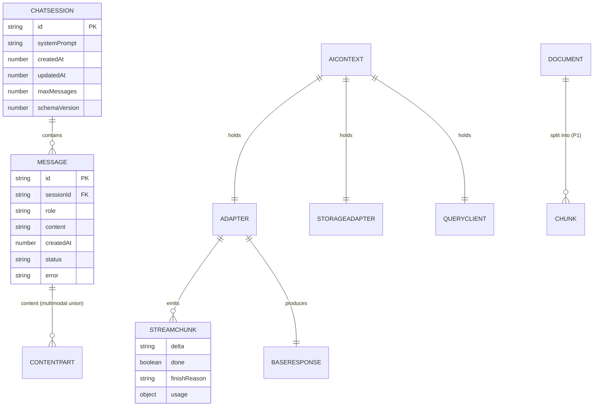
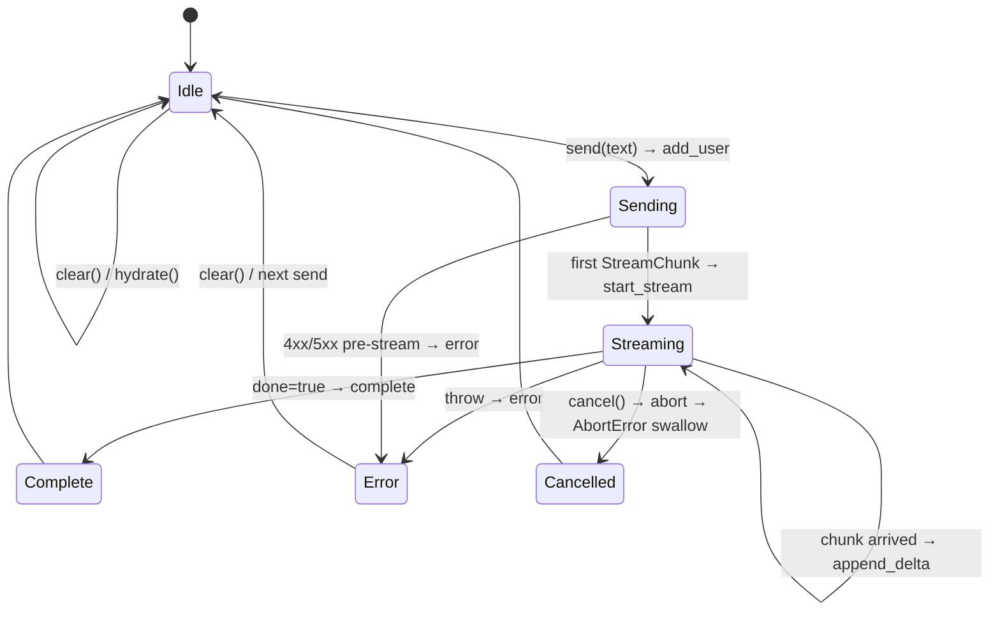

# 03. 내부 데이터 모델 (확정본) — `@org/ai-react`

> **한 줄 요약**: 이 라이브러리에는 DB가 없다. 본 문서는 **(1) 도메인 TypeScript 타입 final**, **(2) React 상태 트리·state diagram**, **(3) localStorage 영속화 스키마(`aireact:v1:*`)**, **(4) `StorageAdapter` 인터페이스 + plug-in 명세**, **(5) `schemaVersion` 마이그레이션 정책**을 확정한다.
>
> **상태**: 확정(Confirmed) — 0.1.0 구현 입력
>
> **spec/와의 관계**:
> - `spec/04_db_preview.md` → 본 문서 §1~§4로 **그대로 채택** + 마이그레이션 정책 보강 + `StorageAdapter` 시그니처 final
> - `spec/03_api_preview.md` Public API에서 import하는 타입은 본 문서가 단일 소스(single source of truth)
>
> **참조**: [`./01_architecture.md`](./01_architecture.md) · [`./02_api_spec.md`](./02_api_spec.md) · [`../spec/04_db_preview.md`](../spec/04_db_preview.md)

---

## 1. 도메인 엔티티 (객체 그래프)

> ⚠️ 관계형 DB가 아니라 **메모리/localStorage 상의 객체 그래프**. ER 도식은 개념 모델로만 본다.



---

## 2. TypeScript 타입 final (`src/types/`)

### 2.1 `types/message.ts`

```ts
export type Role = 'user' | 'assistant' | 'system';

export type ContentPart =
  | { type: 'text'; text: string }
  | { type: 'image'; url: string; mimeType?: string }                   // P2 (Vision)
  | { type: 'file'; name: string; mimeType: string; size: number };     // P1 (FileQa)

export interface Message {
  /** ULID-like (nanoid 사용). 동일 sessionId 내 unique */
  id: string;
  role: Role;
  /** 0.1.0은 string이 일반적, ContentPart[]는 P1/P2에서 활용 */
  content: string | ContentPart[];
  /** epoch ms */
  createdAt: number;
  /** 스트리밍 진행 중인 메시지 식별 */
  status?: 'pending' | 'streaming' | 'complete' | 'error';
  /** error 상태일 때 사람이 읽는 메시지 */
  error?: string;
  /** 자유 메타 (token usage 등). 영속화에 포함됨 */
  metadata?: Record<string, unknown>;
}
```

### 2.2 `types/stream.ts`

```ts
export interface TokenUsage {
  promptTokens?: number;
  completionTokens?: number;
  totalTokens?: number;
}

export interface StreamChunk {
  /** 누적이 아닌 증분 텍스트 */
  delta: string;
  done: boolean;
  finishReason?: 'stop' | 'length' | 'content_filter' | 'tool_calls';
  /** done=true일 때만 포함 (가능한 경우) */
  usage?: TokenUsage;
  /** 디버깅용 원본. production 빌드에서 strip 가능(0.2.0+) */
  raw?: unknown;
}

export interface BaseResponse {
  id: string;
  message: import('./message').Message;
  finishReason?: StreamChunk['finishReason'];
  usage?: TokenUsage;
  model?: string;
}
```

### 2.3 `types/adapter.ts`

```ts
import type { Message } from './message';
import type { BaseResponse, StreamChunk } from './stream';

export interface ChatRequest {
  messages: Message[];
  systemPrompt?: string;
  model?: string;
  temperature?: number;
  maxTokens?: number;
  metadata?: Record<string, unknown>;
}

export interface AdapterStreamOptions {
  signal?: AbortSignal;
}

export interface Adapter {
  readonly id: string;
  chat(req: ChatRequest, opts?: AdapterStreamOptions): Promise<BaseResponse>;
  stream(req: ChatRequest, opts?: AdapterStreamOptions): AsyncIterable<StreamChunk>;
}
```

### 2.4 `types/config.ts`

```ts
export interface OpenAIConfig {
  apiKey?: string;
  proxyUrl?: string;
  dangerouslyAllowBrowser?: boolean;
  model?: string;                // default: 'gpt-4o-mini'
  temperature?: number;          // default: 0.7
  maxTokens?: number;
  headers?: Record<string, string>;
}

export interface LocalConfig {
  baseUrl?: string;              // default: 'http://localhost:11434'
  model: string;                 // required
  temperature?: number;
  keepAlive?: string;
}

export type Engine = 'openai' | 'local';

export type EngineConfig =
  | { engine: 'openai'; config: OpenAIConfig }
  | { engine: 'local'; config: LocalConfig };
```

### 2.5 `types/session.ts`

```ts
import type { Message } from './message';

export const CURRENT_SCHEMA_VERSION = 1 as const;

export interface ChatSession {
  /** sessionId prop과 1:1. default 'default' */
  id: string;
  systemPrompt?: string;
  messages: Message[];
  createdAt: number;
  updatedAt: number;
  /** 마이그레이션 키 */
  schemaVersion: number;
  /** 영속화 한도. AiChatProps.maxMessages와 동기 */
  maxMessages?: number;
}

export interface SessionMeta {
  schemaVersion: number;
  /** 등록된 모든 sessionId 인덱스 */
  sessions: string[];
  /** 가장 최근 active sessionId (선택) */
  activeSessionId?: string;
}
```

### 2.6 `types/document.ts` (P1, 0.2.0)

```ts
export interface Document {
  id: string;
  name: string;
  mimeType: 'application/pdf' | 'text/plain' | string;
  size: number;
  /** 추출된 본문 (PDF는 pdf.js로) */
  text: string;
  chunks?: Chunk[];
}

export interface Chunk {
  id: string;
  documentId: string;
  text: string;
  /** [TBD: client-embedding 채택 시] */
  embedding?: number[];
  /** 원본 텍스트 offset */
  start: number;
  end: number;
}
```

### 2.7 `types/index.ts` 배럴

```ts
export * from './message';
export * from './stream';
export * from './adapter';
export * from './config';
export * from './session';
// export * from './document'; // 0.2.0에서 활성화
```

---

## 3. React 상태 트리

### 3.1 `AiContext` Value

```ts
import type { QueryClient } from '@tanstack/react-query';
import type { Adapter } from '../types/adapter';
import type { OpenAIConfig, LocalConfig, Engine } from '../types/config';
import type { StorageAdapter } from '../storage/StorageAdapter';

export interface AiContextValue {
  engine: Engine;
  adapter: Adapter;
  storage: StorageAdapter;
  queryClient: QueryClient;
  /** 현재 인스턴스의 config (디스크리미네이터로 좁혀짐) */
  config: OpenAIConfig | LocalConfig;
  /** 디버그/관측. production에서는 strip 검토 (0.2.0+) */
  _debug?: { lastError?: Error; adapterId: string };
}
```

### 3.2 `useAiChat` 내부 상태 (reducer 기반)

```ts
interface UseAiChatState {
  messages: Message[];
  isStreaming: boolean;
  error: Error | null;
  abortController: AbortController | null;
}

type UseAiChatAction =
  | { type: 'add_user';        message: Message }
  | { type: 'start_stream';    message: Message; ac: AbortController }
  | { type: 'append_delta';    delta: string }
  | { type: 'complete';        finalMessage: Message }
  | { type: 'error';           error: Error }
  | { type: 'cancel' }
  | { type: 'clear' }
  | { type: 'hydrate';         messages: Message[] };
```

### 3.3 상태 머신 다이어그램



**불변식**:
- `isStreaming === true`인 동안 `send()` 재호출은 reject (`Error("Already streaming. Call cancel() first.")`)
- `role === 'system'` 메시지는 sessionId당 최대 1개 (Provider의 `systemPrompt`에서 자동 prepend)
- `status === 'streaming'` 메시지는 sessionId당 최대 1개
- `messages.length > maxMessages`이면 앞에서 `messages.length - maxMessages`개 삭제 (system 메시지는 보존)
- `Message.id`는 단조 증가(nanoid 21자) — 정렬 시 `createdAt` 우선, 동률은 id

---

## 4. localStorage 영속화 스키마

### 4.1 키 네이밍 (확정)

| 키 | 값 타입 (JSON) | 설명 | 0.1.0 |
|----|---------------|------|-------|
| `aireact:v1:meta` | `SessionMeta` | 인덱스(schemaVersion + sessions[]) | ✅ |
| `aireact:v1:session:{sessionId}` | `ChatSession` | 세션별 메시지 | ✅ |
| `aireact:v1:doc:{docId}` | `Document` | 업로드 문서 | ❌ (0.2.0) |
| `aireact:v1:backup:{ts}:{key}` | (원본 그대로) | 마이그레이션 시 백업 | ✅ |

**키 빌더** (`src/storage/keys.ts`):

```ts
export const STORAGE_PREFIX = 'aireact:v1' as const;

export const k = {
  meta: () => `${STORAGE_PREFIX}:meta`,
  session: (sessionId: string) => `${STORAGE_PREFIX}:session:${sessionId}`,
  doc: (docId: string) => `${STORAGE_PREFIX}:doc:${docId}`,
  backup: (ts: number, originalKey: string) => `${STORAGE_PREFIX}:backup:${ts}:${originalKey}`,
} as const;
```

### 4.2 직렬화 규칙

- `Message.content`가 `ContentPart[]`인 경우 그대로 JSON 직렬화. 바이너리 데이터(이미지/파일 본문)는 **저장하지 않는다** — `image` 타입은 url만, `file` 타입은 메타만
- `Document.text` (P1)는 길이 제한(1MB) 초과 시 잘라서 저장 + `console.warn`. 0.2.0에서 IndexedDB로 분리 검토
- 모든 write는 **debounce 500ms** (`LocalStorageAdapter` 내부에서 처리)
- `JSON.stringify` 실패 시 (순환 참조 등) → 해당 write skip + `console.error`

### 4.3 SSR 안전성 (확정)

```ts
// src/storage/LocalStorageAdapter.ts (시그니처)
export class LocalStorageAdapter implements StorageAdapter {
  private isAvailable(): boolean {
    if (typeof window === 'undefined') return false;
    try {
      const test = '__aireact_test__';
      window.localStorage.setItem(test, '1');
      window.localStorage.removeItem(test);
      return true;
    } catch {
      return false;
    }
  }

  async get<T>(key: string): Promise<T | null> {
    if (!this.isAvailable()) return null;
    /* ... */
  }
  async set<T>(key: string, value: T): Promise<void> {
    if (!this.isAvailable()) return;
    /* debounce + try/catch */
  }
  async remove(key: string): Promise<void> {
    if (!this.isAvailable()) return;
    /* ... */
  }
  async keys(prefix?: string): Promise<string[]> {
    if (!this.isAvailable()) return [];
    /* ... */
  }
}
```

**규칙**:
- SSR에서는 모든 메서드 no-op (get은 `null` 반환)
- `localStorage` 차단 환경(Safari Private Mode 등) 자동 감지 → no-op
- 차단 감지 시 한 번만 `console.warn("localStorage 사용 불가. 영속화가 비활성화되었습니다.")`

### 4.4 인덱싱·성능

| 항목 | 전략 |
|------|------|
| 메시지 추가 | `messages.push()` O(1), 영속화는 throttled write (500ms debounce) |
| 큰 세션 자르기 | `maxMessages` 초과 시 앞에서 N개 잘라 보관 (system 메시지 보존) |
| 렌더 최적화 | `key={Message.id}`, virtualization은 0.2.0+ [TBD] |
| 스트리밍 중 리렌더 | last message만 mutable로 업데이트 (전체 배열 새 참조 1번/16ms 미만) |
| 직렬화 비용 | 큰 세션은 Web Worker 검토 (0.3.0+) |

---

## 5. `StorageAdapter` 인터페이스 (확정)

### 5.1 정의

```ts
// src/storage/StorageAdapter.ts
export interface StorageAdapter {
  /** key가 없으면 null. JSON 파싱 실패 시도 null + console.warn */
  get<T>(key: string): Promise<T | null>;
  /** 동일 키 덮어쓰기. value는 JSON.stringify 가능해야 함 */
  set<T>(key: string, value: T): Promise<void>;
  remove(key: string): Promise<void>;
  /** Optional. localStorage는 prefix 필터링 후 반환 */
  keys?(prefix?: string): Promise<string[]>;
}
```

### 5.2 기본 구현

| 클래스 / 인스턴스 | 파일 | 특성 |
|------------------|------|------|
| `LocalStorageAdapter` | `src/storage/LocalStorageAdapter.ts` | SSR-safe, debounce, schemaVersion 검증 |
| `MemoryStorageAdapter` | `src/storage/MemoryStorageAdapter.ts` | Map 기반, 테스트/SSR 폴백용 |
| `localStorageAdapter` (인스턴스) | `src/storage/index.ts` | `new LocalStorageAdapter()` singleton |
| `memoryStorageAdapter` (인스턴스) | `src/storage/index.ts` | `new MemoryStorageAdapter()` singleton |

### 5.3 Plug-in 시나리오 (확장 예시)

```ts
// 사용자 코드 — IndexedDB로 교체
import { AiProvider } from '@org/ai-react';
import { IDBStorageAdapter } from './my-idb-adapter'; // 사용자 구현

<AiProvider engine="openai" config={{...}} storage={new IDBStorageAdapter()}>
  <App />
</AiProvider>
```

**계약**:
- 모든 메서드는 비동기 (Promise)
- get은 키 없을 때 throw 하지 않고 `null`
- set은 실패해도 throw 하지 않을 권장 (silently warn). 사용자 구현은 자유
- keys는 optional. 미구현 시 라이브러리는 인덱스를 `meta` 키에서만 조회

---

## 6. `schemaVersion` 마이그레이션 정책 (확정)

### 6.1 원칙

- 모든 영속화 객체(`ChatSession`, `SessionMeta`)는 `schemaVersion: number` 필드 보유
- 0.1.0의 `CURRENT_SCHEMA_VERSION = 1`
- 읽기 시점 `schemaVersion` 비교:
  - **같음**: 그대로 사용
  - **낮음(예: v0)**: best-effort 마이그레이션 함수 실행 → 백업 키 생성 후 새 형식 저장
  - **높음**: 라이브러리가 더 낮은 버전 → 해당 키 무시 + `console.warn` (강제 다운그레이드 금지)
- 마이그레이션 실패 시: 원본을 백업 키(`aireact:v1:backup:{ts}:{originalKey}`)로 옮기고 새 세션을 빈 상태로 시작

### 6.2 마이그레이션 함수 시그니처

```ts
// src/storage/migrate.ts
export type Migrator = (raw: unknown) => unknown;

export const migrators: Record<number, Migrator> = {
  // v0 → v1 (0.1.0 시점에서는 비어있음. 0.2.0+에서 채워짐)
  // 0: (raw) => ({ ...raw, schemaVersion: 1, /* ... */ }),
};

export function migrate(raw: unknown, currentVersion: number): unknown {
  let cur = raw;
  let v = (raw as any)?.schemaVersion ?? 0;
  while (v < currentVersion) {
    const m = migrators[v];
    if (!m) throw new Error(`No migrator for schemaVersion ${v}`);
    cur = m(cur);
    v = (cur as any)?.schemaVersion ?? v + 1;
  }
  return cur;
}
```

### 6.3 백업 정책

- 마이그레이션 시도 직전 원본 → `aireact:v1:backup:{Date.now()}:{originalKey}` 로 복사
- 백업 키는 24시간 이상 유지 (자동 삭제는 0.2.0+에서 검토). localStorage 용량 압박 시 사용자가 수동 삭제 가능하도록 README 안내
- 마이그레이션 성공 시 백업 키를 즉시 삭제하지 않는다 (사용자 신뢰 확보)

### 6.4 0.x 호환성 정책

- 0.1.0 → 0.2.0 사이 schemaVersion 증가는 **허용**. CHANGELOG `### Migration` 섹션 의무
- 1.0.0부터 schemaVersion bump는 **major bump 동반**

---

## 7. 검증·불변식 (확정)

| 불변식 | 검증 위치 |
|--------|----------|
| `Message.id` unique within sessionId | reducer add_user / start_stream에서 ID 충돌 시 새 nanoid 생성 |
| `Message.role === 'system'`은 세션당 최대 1개 | Provider의 systemPrompt가 prepend 시 기존 system 제거 |
| `Message.status === 'streaming'`은 세션당 최대 1개 | reducer start_stream은 기존 streaming complete 처리 |
| `messages.length <= maxMessages` | reducer 모든 mutation 후 trim |
| `ChatSession.schemaVersion === CURRENT_SCHEMA_VERSION` | LocalStorageAdapter.get에서 검증 |
| `LocalConfig.model` non-empty | AiProvider 검증 |
| `OpenAIConfig` 보안 검증 (§02 §A.1) | AiProvider 검증 |

---

## 8. 미해소 항목 (0.1.0 차단 표기)

| 항목 | 출처 | 0.1.0 차단? | 결정 |
|------|------|------------|------|
| TokenUsage 영속화 | spec/04 §7 | No | 메모리만(0.1.0). `useAiChat.onComplete(msg, usage)` 인자 노출. metadata에는 미저장 |
| IndexedDB 분리 시점 | spec/04 §7 | No | 0.2.0 (FileQA에서 4MB 텍스트 발생 시) |
| 멀티 세션 UI 기본 제공 | spec/04 §7 | No | 0.1.0은 단일 sessionId(default), prop으로 변경. UI는 0.2.0+ |
| `Message.content`를 `ContentPart[]` 단일화 | spec/04 §7 | No | union 유지(`string \| ContentPart[]`). 1.0.0 동결 시 재검토 |

---

## 9. 팀 전달 사항

### 9.1 frontend-dev에게
- `useAiChat`은 본 문서 §3.2 reducer + §3.3 state diagram을 그대로 구현. action type 이름·전이 변경 금지
- 메시지 ID는 `nanoid(21)` 사용. 직접 `Date.now()` 등을 ID로 쓰지 말 것
- `<AiChat>`은 hydrate 시점에 (1) Provider effect에서 `storage.get(k.session(sessionId))` → reducer `hydrate` action dispatch, (2) Strict Mode double-effect 안전 (idempotent)
- 스트리밍 중 마지막 메시지 mutable 업데이트는 reducer 내부에서만 (외부에서 messages 배열을 직접 mutate 금지)
- system 메시지는 Provider의 `systemPrompt` 변경 시에만 갱신 (사용자가 `send`로 추가 못 하게)

### 9.2 backend-dev에게
- `LocalStorageAdapter`: §4.3 SSR 가드, §4.2 debounce 500ms, §6 마이그레이션 진입을 정확히 구현
- `keys.ts` 빌더만 사용. raw `'aireact:v1:...'` 문자열 코드 내 hard-code 금지
- `MemoryStorageAdapter`는 vitest 환경 기본값. 단순 Map<string, string> 기반 + `JSON.stringify`/`JSON.parse`
- 마이그레이션 실패 시 백업 키 생성 → 그 후 throw. 호출자(useAiChat)가 catch해서 빈 세션으로 시작
- `LocalStorageAdapter.set`은 debounce되므로 unmount 직전 즉시 flush 필요 (`flush()` 메서드 추가, AiProvider cleanup에서 호출)

### 9.3 qa-engineer에게
- §3.3 state diagram의 모든 전이를 reducer 단위 테스트 (action 입력 → 다음 상태 검증)
- §4 영속화: (1) write debounce, (2) SSR no-op, (3) 차단 환경 detect, (4) maxMessages trim, (5) schemaVersion mismatch → 백업 + 빈 시작 5종
- §6 마이그레이션: 0.1.0은 v0→v1 migrator가 비어있지만 mismatch 시 백업 동작 검증
- nanoid 충돌 시뮬레이션 (모킹)으로 `Message.id` unique 보장 검증

### 9.4 devops-engineer에게
- 본 문서의 타입(특히 `CURRENT_SCHEMA_VERSION`)은 ESM/CJS 빌드에서 const로 보존되어야 함 — `tree-shaking` 후에도 값 유지 확인
- `attw` 통과 확인 시 본 문서 §2의 모든 export가 type-only로 분리되지 않게 (런타임 값과 타입을 명확히 구분)
- size-limit는 본 문서 §4 LocalStorageAdapter 포함 후 측정 (debounce 로직 ~ 0.5KB 추가 예상)
