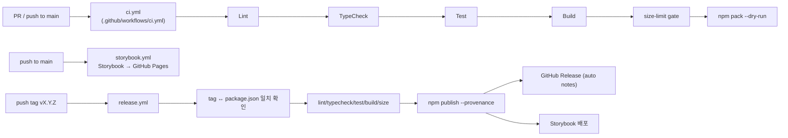
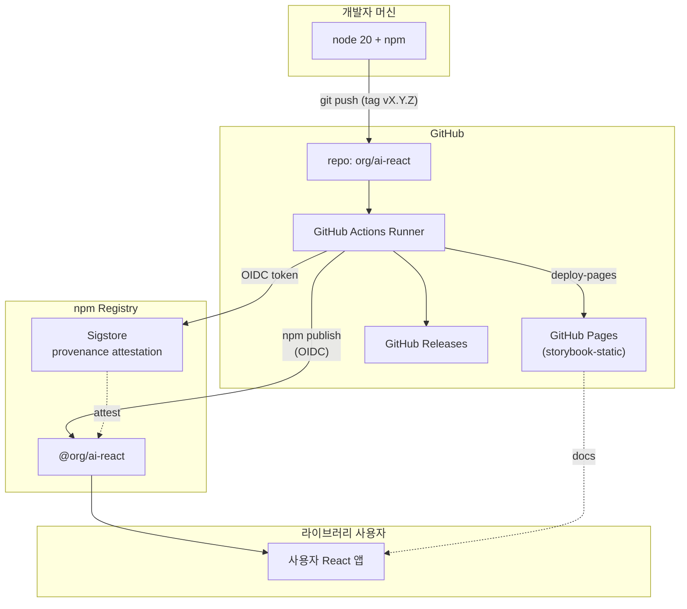

# 05. 배포 가이드 — `@org/ai-react` (npm 패키지)

> **이 프로젝트는 서버 배포가 아니라 npm 패키지 publish 파이프라인입니다.**
>
> **상태**: 확정(Confirmed) — 0.1.0 인프라 입력
>
> **참조**: [`./00_input.md`](./00_input.md) · [`./01_architecture.md`](./01_architecture.md) · [`../spec/06_milestones.md`](../spec/06_milestones.md)

---

## 1. 배포 모델 (요약)

| 산출물 | 대상 | 트리거 | 배포처 |
|--------|------|--------|-------|
| npm 패키지 (`@org/ai-react`) | 라이브러리 사용자 | semver 태그 push (`vX.Y.Z`) | npm registry (provenance 서명) |
| Storybook static | 라이브러리 데모/문서 | main push + 릴리즈 | GitHub Pages |
| `dist/` 아티팩트 | CI 검증 | 모든 PR/push | GitHub Actions Artifacts (7일 보관) |

**서버/DB/도메인 없음**. SSL/CDN/모니터링은 npm registry + GitHub Pages가 처리.

---

## 2. 환경 구성

### 2.1 환경변수

라이브러리 사용자가 런타임에 주입하는 변수는 없다 (props로 전달). 그러나 **CI/배포** 시에는 다음이 필요하다.

| 변수명 | 위치 | 설명 | 필수 |
|--------|------|------|------|
| `NPM_TOKEN` | GitHub Actions Secrets | npm publish 인증 (Automation Token, `publish` 권한). OIDC provenance 활성화에도 함께 필요 | publish 시 |
| `GITHUB_TOKEN` | Actions에서 자동 주입 | Pages 배포 + GitHub Release 작성 | 자동 |

라이브러리 자체는 환경변수를 읽지 **않는다**. `.env.example`은 라이브러리 사용자(앱 측)의 권장 패턴을 보이는 용도일 뿐 라이브러리 코드에는 영향이 없다.

### 2.2 `.env.example` (라이브러리 소비자 권장 템플릿)

라이브러리 사용자가 proxy 모드로 운영할 때의 백엔드 권장 패턴.

```env
# 사용자 백엔드(.env) — 라이브러리는 이 변수를 직접 읽지 않는다.
# Express/Next.js Route Handler 등에서 OPENAI_API_KEY를 보관 → 프록시로 forward.
OPENAI_API_KEY=
OPENAI_BASE_URL=https://api.openai.com/v1
```

> 라이브러리는 절대 `process.env.OPENAI_API_KEY`를 읽지 않는다. 모든 비밀은 사용자 backend가 관리한다.

### 2.3 GitHub Environments

| Environment | 용도 | Required reviewers | Secrets |
|-------------|------|-------------------|---------|
| `npm-publish` | release.yml의 publish job | 1명 (프로덕션 보호) | `NPM_TOKEN` |
| `github-pages` | Storybook 배포 | 없음 | (없음 — OIDC) |

---

## 3. 버전 정책 & dist-tag

### 3.1 버전 정책 (0.x)

- `0.1.0-alpha.0` → `0.1.0-beta.X` → `0.1.0-rc.X` → `0.1.0`
- `0.1.x` patch는 **버그 수정만**. API 변경 금지
- `0.x` minor는 **breaking 허용**. CHANGELOG `### Migration` 섹션 의무
- `1.0.0` 이후 SemVer 엄격

### 3.2 dist-tag 매핑 (release.yml에서 자동)

| 태그 패턴 | dist-tag | 의미 |
|----------|---------|------|
| `vX.Y.Z` | `latest` | 안정 릴리즈. `npm install @org/ai-react`의 default |
| `vX.Y.Z-alpha.*` / `-beta.*` / `-rc.*` | `next` | 프리릴리즈. `npm install @org/ai-react@next` |
| `vX.Y.Z-canary.*` | `canary` | 일일 빌드. `npm install @org/ai-react@canary` |

수동 변경: `npm dist-tag add @org/ai-react@0.1.0 latest`

---

## 4. CI/CD 파이프라인

### 4.1 워크플로우 토폴로지



### 4.2 CI (`.github/workflows/ci.yml`)

**트리거**: PR, main push.
**노드**: Node 20.
**단계**: install → lint → typecheck → test:coverage → build → size → pack:smoke → upload artifacts.
**permissions**: `contents: read`만.
**concurrency**: 같은 ref 중복 실행 취소.

> Node 18/22, React 19 매트릭스는 0.2.0에 추가 (architect 14.4 노트).

### 4.3 Release (`.github/workflows/release.yml`)

**트리거**: `v*.*.*` 태그 push.
**핵심 게이트**:
1. 태그 ↔ `package.json.version` 일치 확인 (mismatch 시 실패)
2. CI 동일 검증(lint/typecheck/test/build/size)을 publish 직전에 한 번 더
3. `npm publish --provenance --access public --tag <auto-detected dist-tag>`
4. GitHub Release 자동 노트 작성
5. Storybook GitHub Pages 배포

**OIDC**: `permissions: id-token: write` 필수. provenance attestation은 GitHub OIDC 토큰을 사용해 npm sigstore에 자동 기록.

### 4.4 Storybook (`.github/workflows/storybook.yml`)

**트리거**: main push + manual dispatch.
**용도**: 릴리즈 사이 main 브랜치 데모 페이지 최신화.
**Pages**: `actions/deploy-pages@v4` (OIDC).

---

## 5. 최초 배포 절차 (0.1.0)

### 5.1 npm 조직 / 패키지 사전 작업 (1회)

1. npmjs.com에 organization `@org` 생성 (또는 기존 조직 사용)
2. 패키지 이름 가용성 확인: `npm view @org/ai-react` → 404 정상
3. **Automation Token** 발급 (npm Web → Access Tokens → Generate New Token → "Automation"). publish + provenance 권한
4. GitHub repo Settings → Secrets → Actions에 `NPM_TOKEN` 등록
5. GitHub repo Settings → Environments → `npm-publish` 생성 + required reviewer 지정
6. GitHub repo Settings → Pages → Source: GitHub Actions

### 5.2 첫 publish (alpha)

```bash
# 1. main 동기화 + 깨끗한 워킹트리 확인
git checkout main && git pull

# 2. 버전 bump (이미 package.json에 0.1.0-alpha.0 작성됨 → 그대로 사용)
#    또는 npm version 사용:
# npm version 0.1.0-alpha.0 --no-git-tag-version

# 3. CHANGELOG.md 업데이트 + commit
git add package.json CHANGELOG.md
git commit -m "chore(release): v0.1.0-alpha.0"

# 4. 태그 push (release.yml 트리거)
git tag v0.1.0-alpha.0
git push origin main --tags
```

`release.yml`이 자동으로:
- 검증 → 빌드 → `npm publish --tag next --provenance`
- npm 페이지에서 "Sigstore" 배지 노출
- `npm install @org/ai-react@next`로 설치 가능

### 5.3 안정 릴리즈 (0.1.0)

동일하게 `v0.1.0` 태그 push → dist-tag 자동 `latest`.

---

## 6. 업데이트 배포 절차

### 6.1 patch (0.1.0 → 0.1.1)

1. PR 머지 (CI green)
2. `npm version patch --no-git-tag-version` (또는 수동 bump)
3. CHANGELOG `### [0.1.1]` 섹션 작성
4. commit → `git tag v0.1.1` → `git push --tags`

### 6.2 minor (0.1.x → 0.2.0)

1. patch 절차 동일
2. CHANGELOG `### Migration` 섹션 의무 작성 (breaking 항목)
3. README/Storybook의 "Compatibility" 표 업데이트

### 6.3 prerelease

```bash
npm version 0.2.0-beta.0 --no-git-tag-version
git tag v0.2.0-beta.0 && git push --tags
# → dist-tag = next, 사용자는 `@next`로 미리 시험
```

---

## 7. 인프라 구성도



---

## 8. 모니터링 / 관측

| 항목 | 도구 | 설정 |
|------|------|------|
| 다운로드 통계 | npm + npmjs.com 페이지 | 자동 |
| 번들 사이즈 추이 | bundlephobia + size-limit CI | PR마다 차단 |
| 타입 정합성 | `@arethetypeswrong/cli` (0.2.0 추가) | `npx attw --pack` |
| 빌드 시간 / 파이프라인 | GitHub Actions Insights | Actions → Workflows |
| 이슈/사용자 신호 | GitHub Issues + Discussions | Issue 템플릿 (0.2.0) |
| 보안 취약점 | Dependabot + `npm audit` (CI 외 수동) | `.github/dependabot.yml`은 0.2.0 |

> 라이브러리는 런타임 텔레메트리를 **전송하지 않는다**. 사용자 앱의 모니터링은 사용자 책임 (Sentry/Datadog 등 자유).

---

## 9. 롤백 절차

### 9.1 npm `unpublish`는 72시간 내에만 허용 (그 외에는 `deprecate`)

```bash
# 72h 이내, 사용자 거의 없을 때
npm unpublish @org/ai-react@0.1.0

# 그 이후 — 패키지에 deprecation 메시지 부착
npm deprecate @org/ai-react@0.1.0 "Critical bug. Use 0.1.1+"
```

### 9.2 dist-tag 롤백

```bash
# latest를 이전 버전으로 되돌림
npm dist-tag add @org/ai-react@0.0.9 latest
```

새 사용자(`npm install @org/ai-react`)는 즉시 0.0.9를 받게 된다.

### 9.3 hot-fix 릴리즈

`unpublish`/`deprecate`보다 권장되는 옵션. 영향받는 파일만 수정 → patch 릴리즈 (`v0.1.1`) → CHANGELOG에 retraction 노트.

---

## 10. 보안 체크리스트

- [x] `npm publish --provenance` (Sigstore + GitHub OIDC)
- [x] `NPM_TOKEN`은 Automation Token + GitHub Environment 필수 reviewer
- [x] release.yml에서 태그 ↔ package.json 버전 일치 검증
- [x] `permissions:` 최소권한 (CI는 `contents: read`만, release는 `id-token: write` + `contents: write`)
- [x] direct-mode `dangerouslyAllowBrowser` 강제 (런타임)
- [x] `LICENSE`(MIT) + `package.json.license: "MIT"` 일치
- [x] `files`로 publish 산출물 명시 (`dist`, `README.md`, `LICENSE`, `CHANGELOG.md`만)
- [x] `.gitignore`로 secret 누출 방지 (`.env*`)
- [ ] Dependabot 활성화 (0.2.0 시점)
- [ ] `attw` (arethetypeswrong) CI gate (0.2.0 시점)

---

## 11. README 배지

```md
[](https://www.npmjs.com/package/@org/ai-react)
[](https://bundlephobia.com/package/@org/ai-react)
[](./LICENSE)
[](https://github.com/org/ai-react/actions/workflows/ci.yml)
[](https://docs.npmjs.com/generating-provenance-statements)
```

---

## 12. 릴리즈 체크리스트 (운영)

각 릴리즈에서 확인:

- [ ] `package.json.version` 결정 (alpha/beta/rc/stable)
- [ ] CHANGELOG.md `### [X.Y.Z]` 섹션 작성 (Added/Changed/Fixed/Migration)
- [ ] README의 "What's included" 표 동기화
- [ ] `npm run lint && npm run typecheck && npm run test && npm run build && npm run size` 로컬 통과
- [ ] `npm pack --dry-run` 으로 산출물 확인 (`dist/index.{mjs,cjs,d.ts}`, `dist/preset.{mjs,cjs,d.ts}`, `README.md`, `LICENSE`)
- [ ] 깨끗한 워킹트리에서 `git tag vX.Y.Z` + `git push --tags`
- [ ] release.yml 성공 확인 → npm 페이지에서 provenance 배지 확인
- [ ] Storybook GitHub Pages 갱신 확인
- [ ] Discussions/Twitter 등 사용자 채널 공지 (0.2.0+)

---

## 13. 미해소 항목 [TBD]

| 항목 | 상태 | 결정 시점 |
|------|------|----------|
| `@arethetypeswrong/cli` CI 게이트 | TBD | 0.2.0 |
| Node 18/22 + React 19 매트릭스 | TBD | 0.2.0 (architect §14.4 noted) |
| `semantic-release` 자동화 도입 | TBD | 0.2.0 (현재는 수동 태그 push) |
| Dependabot/Renovate | TBD | 0.2.0 |
| Chromatic Storybook visual regression | TBD | 0.2.0 (NFR-8 nice-to-have) |

---

## 14. 팀 전달 사항

### 14.1 frontend-dev / backend-dev에게
- **신규 의존성 추가 시**: PR에서 `package.json`만 수정하지 말고 본 가이드 §10 보안 체크와 size-limit 영향(`npm run size`)을 함께 보고
- **새 export 추가 시**: `package.json.exports` 맵을 건드리는 변경은 devops review 필요 (deep import는 0.2.0까지 금지)
- 빌드 결과는 `dist/index.mjs`/`dist/index.cjs`/`dist/index.d.ts` + preset 3쌍이어야 함. 이 외 파일이 생기면 `vite.config.ts`/`tsconfig.build.json` 검토

### 14.2 qa-engineer에게
- CI에서 `test:coverage`로 실행. coverage 80% 미달은 fail
- size-limit는 CI에서 차단 게이트. 새 코드가 budget을 깨면 본 가이드 §1의 매트릭스 조정을 architect와 합의
- MSW handler는 `test/msw/`에 두고, `vitest.setup.ts`의 주석을 풀어 wire-up

### 14.3 architect에게
- 본 가이드의 미해소 항목(§13)은 0.2.0 진입 시 점검 부탁
