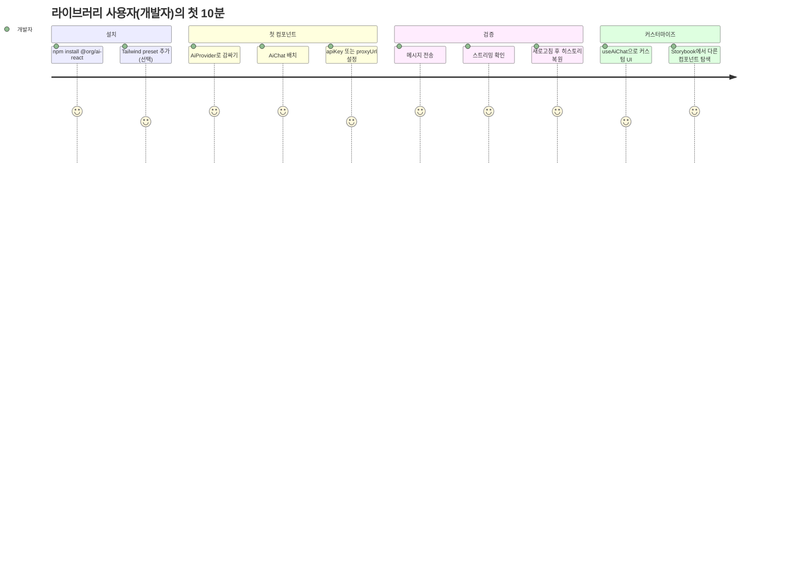

# 01. PRD — `@org/ai-react`

> **한 줄 요약**: React 개발자가 `import` 한 번으로 AI 기능(Chat/Summary/Rewrite/FileQA)을 붙일 수 있는 컴포넌트형 AI 런타임 라이브러리. OpenAI/Local LLM(Ollama)을 동일 인터페이스로 추상화.
>
> **상태**: 초안(Draft) — `_workspace/01_architecture.md`로 승격 예정
>
> **참조**: [`idea.md`](../idea.md) · [`idea_inquiry.md`](../idea_inquiry.md) · [02_architecture_preview](./02_architecture_preview.md) · [03_api_preview](./03_api_preview.md)

---

## 1. 제품 정의

### 1.1 What
프론트엔드 개발자가 백엔드/스트리밍/Provider 통합을 직접 구현하지 않고도 React 컴포넌트와 Hook을 `import` 한 번으로 사용할 수 있는 npm 패키지(`@org/ai-react`).

### 1.2 Why
- AI SDK들은 대부분 "Chat" 중심이라 Summary/Rewrite 같은 **기능형 단위**가 비어있다.
- SSE 스트리밍, 키 관리, 어댑터 정규화는 매 프로젝트마다 반복 구현된다.
- 로컬 LLM(Ollama)을 쓰려면 별도 통합 작업이 필요하다.

### 1.3 Who
| 사용자층 | 설명 |
|---------|-----|
| Primary | React 프론트엔드 개발자 (백엔드 미숙) |
| Primary | 1인/소규모 프로토타입·내부도구 팀 |
| Secondary | AI 생성 프론트 초안에 기능을 빠르게 결합하는 바이브 코더 |
| Tertiary | 기존 디자인 시스템에 AI 기능을 헤드리스 컴포넌트로 통합하려는 팀 |

### 1.4 Not For
- 자체 모델 학습/파인튜닝이 필요한 ML 엔지니어
- no-code 앱 빌더를 만들려는 사용자
- 결제/팀 협업/워크플로우 빌더가 필요한 SaaS 운영자

---

## 2. 사용자 스토리 & 수락 기준

### P0 — 0.1.0 릴리즈

#### US-1. AiProvider 주입 (P0)
> 개발자로서 나는 `<AiProvider engine="openai" config={{ apiKey }}>`로 앱을 감싸기만 하면 하위 모든 AI 컴포넌트가 동일한 엔진을 사용하기를 원한다.

**수락 기준**
- [ ] `engine: "openai" | "local"` prop으로 어댑터를 전환할 수 있다.
- [ ] `config` prop이 어댑터별 타입으로 좁혀진다(discriminated union).
- [ ] Provider 외부에서 Hook 사용 시 명확한 에러 throw.
- [ ] `dangerouslyAllowBrowser: true` 미지정 + apiKey 직접 전달 시 dev 콘솔 경고.

#### US-2. 채팅 UI 즉시 사용 (P0)
> 개발자로서 나는 `<AiChat />`만 배치하면 메시지 입력·전송·스트리밍 응답·히스토리가 모두 작동하기를 원한다.

**수락 기준**
- [ ] 첫 토큰 표시까지 평균 < 1.5s (네트워크 정상 가정).
- [ ] 스트리밍 중 취소 버튼이 어댑터의 `AbortController`로 즉시 중단.
- [ ] 새로고침 후에도 직전 세션 메시지 복원(localStorage 기본값).
- [ ] 키보드 접근성: Enter 전송, Shift+Enter 줄바꿈, ESC 취소.

#### US-3. 요약 버튼 (P0)
> 개발자로서 나는 `<AiSummaryButton input={text} />`만 배치하면 클릭 시 요약 결과가 팝오버로 뜨기를 원한다.

**수락 기준**
- [ ] `input`이 빈 문자열이면 disabled.
- [ ] 결과는 자식으로 render-prop / 기본 팝오버 둘 다 지원.
- [ ] 진행 중 클릭 시 중복 호출 방지(in-flight lock).

#### US-4. Hook 기반 커스텀 채팅 UI (P0)
> 개발자로서 나는 `useAiChat()`을 통해 메시지·전송 함수·스트리밍 상태에 접근해 나만의 UI를 만들고 싶다.

**수락 기준**
- [ ] `messages`, `send`, `cancel`, `isStreaming`, `error` 5개 필드 노출.
- [ ] `onChunk(chunk)` / `onComplete(message)` 콜백 옵션.
- [ ] React 18 Strict Mode에서 이중 effect 안전.

#### US-5. OpenAI 어댑터 (P0)
> 개발자로서 나는 OpenAI Chat Completions API를 SSE 스트리밍으로 사용할 수 있어야 한다.

**수락 기준**
- [ ] `model`, `temperature`, `proxyUrl`, `apiKey`, `dangerouslyAllowBrowser` 옵션 제공.
- [ ] `proxyUrl` 지정 시 모든 요청을 해당 URL로 전달(키 노출 없음).
- [ ] Rate limit(429) 시 1회 exponential backoff 재시도 후 throw.

#### US-6. 로컬 LLM 어댑터 (P0)
> 개발자로서 나는 Ollama가 설치된 로컬에서 별도 백엔드 없이 LLM을 호출하고 싶다.

**수락 기준**
- [ ] 기본 `baseUrl: http://localhost:11434`, prop으로 변경 가능.
- [ ] `/api/chat` 스트리밍 응답을 NDJSON으로 정규화해 `StreamChunk`로 변환.
- [ ] 연결 실패 시 "Ollama가 실행 중인지 확인" 가이드 에러 메시지.

### P1 — 0.2.0

#### US-7. 톤 변경/재작성 (P1)
- [ ] `<AiRewriteButton input={text} tone="formal|casual|concise" />`.
- [ ] 결과 텍스트로 input을 교체하는 controlled 패턴 + onResult 콜백.

#### US-8. 파일 QA 패널 (P1)
- [ ] PDF/TXT 드래그앤드롭 업로드.
- [ ] 클라이언트 임베딩 또는 단순 chunk-and-prompt 방식 [TBD: P1 진입 시 결정].
- [ ] 한 문서당 최대 4MB / 멀티 문서 [TBD].

### P2 — 1.0.0+

#### US-9. Vision/추론 확장 (P2)
- 이미지 입력 → 분석 결과 텍스트.
- 비전 어댑터 추가 시 기존 컴포넌트 코드 변경 0줄.

---

## 3. 비기능 요구사항 (NFR)

| ID | 항목 | 요구사항 |
|----|------|---------|
| NFR-1 | 번들 크기 | 코어(Provider+useAiChat) gzip < 15KB, OpenAIAdapter < 8KB, 트리셰이킹 friendly(`sideEffects: false`) |
| NFR-2 | 타입 안전성 | TypeScript strict, 어댑터별 config 타입을 discriminated union으로 좁힘 |
| NFR-3 | 호환성 | React 18+, Node 18+(dev), ESM+CJS 듀얼 출력 |
| NFR-4 | 접근성 | WAI-ARIA: `role="log"`, `aria-live="polite"` 채팅 영역, 키보드 100% 조작 |
| NFR-5 | 보안 | 직접 호출 모드는 `dangerouslyAllowBrowser` flag 강제, 미지정 시 런타임 throw |
| NFR-6 | 성능 | 첫 토큰 표시 < 1.5s(network ok), 스트리밍 중 입력 lag < 16ms |
| NFR-7 | 테스트 | 핵심 어댑터/Hook 단위테스트 커버리지 ≥ 80%, MSW로 SSE 모킹 |
| NFR-8 | 문서 | Storybook에 컴포넌트별 인터랙티브 stories + MDX 사용 가이드 |
| NFR-9 | 라이선스 | MIT, 의존성 라이선스 호환성 자동 검사(CI) |
| NFR-10 | 영속화 | localStorage 기본 + custom storage adapter, SSR 환경 안전(window guard) |

---

## 4. 사용자 여정

---

## 5. 성공 지표

| 지표 | 목표 | 측정 방법 |
|------|------|----------|
| TTFC (Time-to-first-component) | < 10분 | Storybook quickstart 가이드 따라 측정 |
| 번들 크기 (코어) | gzip < 15KB | `size-limit` CI 검사 |
| Issue 응답 시간 | 평균 < 72h (0.x 단계) | GitHub Issues 통계 |
| 0.1.0 첫 주 npm 다운로드 | > 50 | npm weekly stats |
| 핵심 어댑터 테스트 커버리지 | ≥ 80% | Vitest coverage 리포트 |

---

## 6. 가정 및 제약

- **가정**: 라이브러리 사용자는 React 18+를 사용하고 ESM 환경(Vite/Next.js/Remix)이 다수.
- **가정**: Tailwind 사용자는 preset import만으로 통합 가능.
- **제약**: 0.1.0은 자체 백엔드를 제공하지 않음(`proxyUrl`은 사용자가 BYO).
- **제약**: 1.0.0 전까지 minor에서 breaking change 가능(SemVer 0.x 규칙).

---

## 7. 제외 범위 (Out of Scope)

- 자체 LLM 호스팅/모델 학습.
- 결제/구독/팀 권한 모델.
- React 외 프레임워크(Vue/Svelte/Solid) 바인딩 — [TBD: 1.0 이후].
- 서버 컴포넌트(RSC) 전용 API — [TBD: 0.3.0에서 검토].

---

## 8. 후속 결정 필요 (Open Questions)

- [TBD: AiFileQaPanel의 RAG 구현 위치 — 클라이언트 임베딩 vs 백엔드 위임]
- [TBD: 토큰 사용량/비용 telemetry 노출 여부]
- [TBD: 스트리밍 응답 마크다운 렌더러 내장 여부 (KaTeX/Prism 포함 시 번들 영향)]
