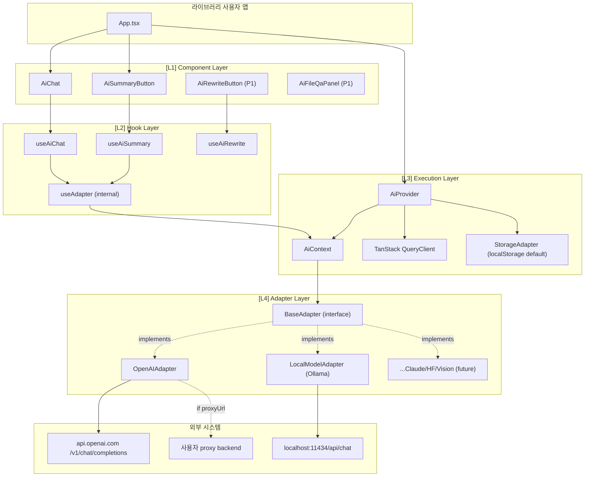
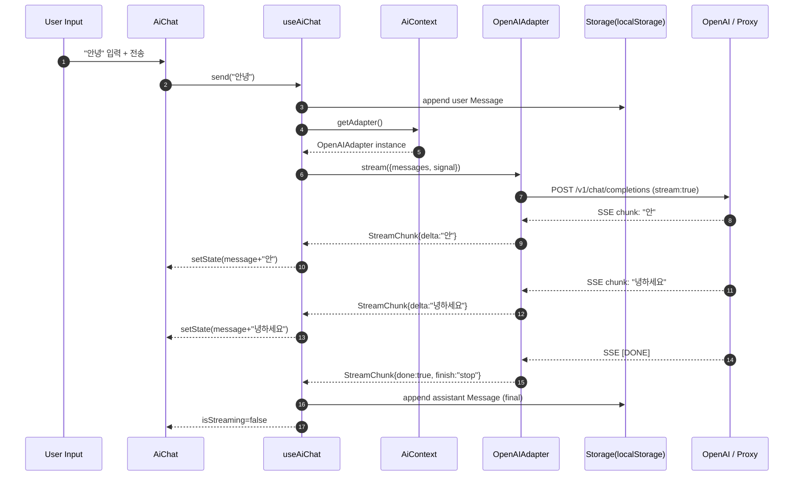
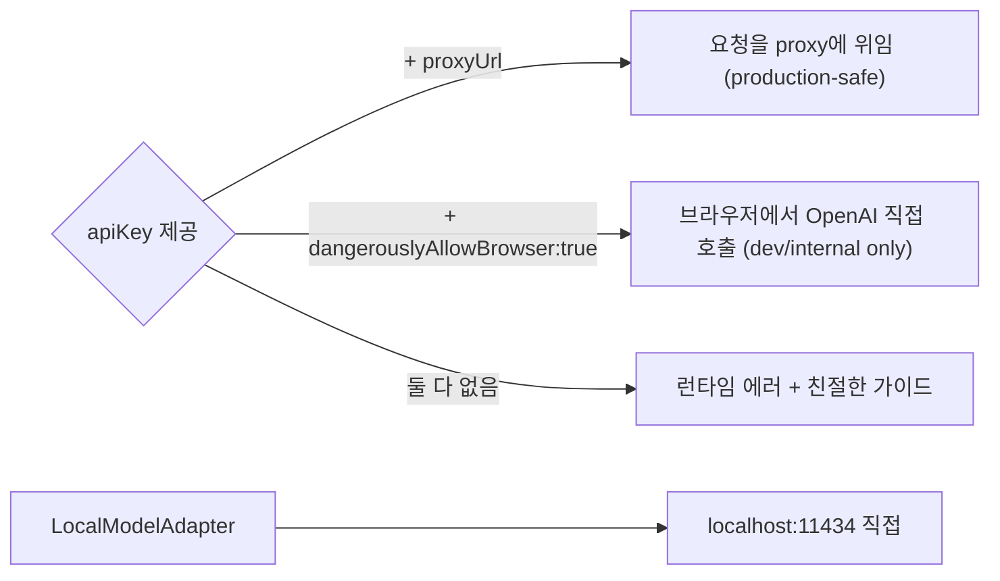
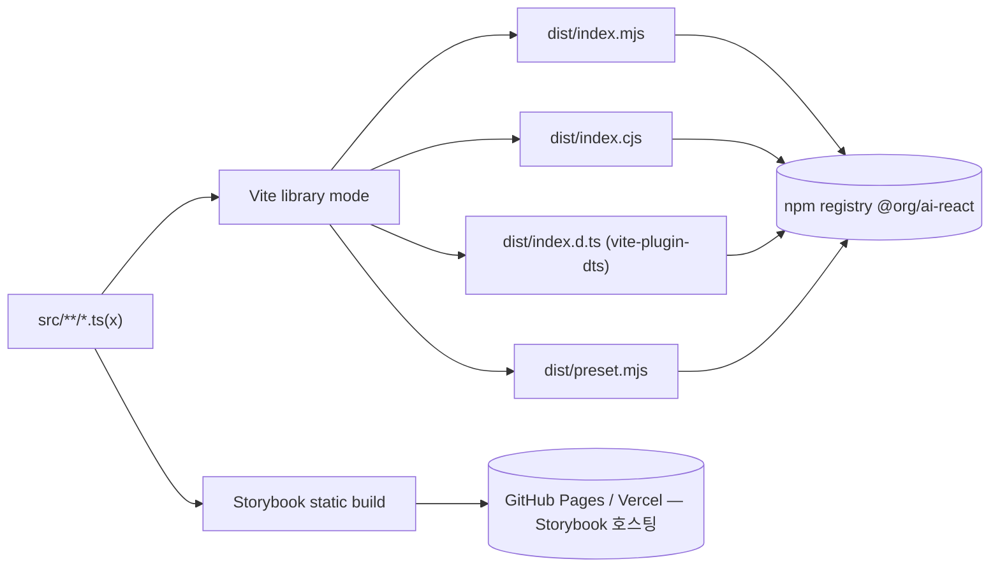

# 02. 아키텍처 프리뷰 — `@org/ai-react`

> **한 줄 요약**: 4계층(Component → Hook → Execution → Adapter) 어댑터 패턴 라이브러리. `AiProvider`가 Context로 어댑터 인스턴스를 주입하고, 모든 어댑터는 `BaseResponse`/`StreamChunk`로 응답을 정규화한다.
>
> **상태**: 초안(Draft) — `_workspace/01_architecture.md`로 승격 예정
>
> **참조**: [01_prd](./01_prd.md) · [03_api_preview](./03_api_preview.md) · [04_db_preview](./04_db_preview.md)

---

## 1. 4-Layer Architecture



---

## 2. 계층별 책임

| 계층 | 책임 | 결정 사항 | 의존 |
|------|------|----------|------|
| **L1 Component** | 사용자가 `import`해 쓰는 UI. Headless + className 슬롯 + data-attribute. | Tailwind preset은 별도 서브패스(`@org/ai-react/preset`) | L2 |
| **L2 Hook** | 비즈니스 로직 캡슐화. UI 비종속. 자체 UI 제작용 공개 hooks + 내부 hooks. | `useAdapter`는 internal export 안 함 | L3 |
| **L3 Execution** | Provider/Context, QueryClient 인스턴스, StorageAdapter 주입. | Provider 안에 자체 QueryClient 생성, 외부 주입도 허용 | L4 |
| **L4 Adapter** | 외부 LLM 통신, 응답 정규화(`BaseResponse`/`StreamChunk`). | 모든 어댑터는 `chat/complete/stream` 메서드 시그니처 통일 | External |

---

## 3. 데이터 흐름 — 채팅 1회 요청



---

## 4. 어댑터 인터페이스 (요약)

```ts
interface BaseAdapter {
  readonly id: 'openai' | 'local' | string;
  chat(req: ChatRequest, opts?: { signal?: AbortSignal }): Promise<BaseResponse>;
  stream(req: ChatRequest, opts?: { signal?: AbortSignal }): AsyncIterable<StreamChunk>;
}
```
- `BaseResponse`/`StreamChunk` 정의는 [04_db_preview](./04_db_preview.md) 참조.
- 모든 어댑터는 동일 인터페이스를 구현하므로 컴포넌트 코드는 어댑터에 무지(無知).

---

## 5. 보안 모델



- **기본값**: `proxyUrl` 권장. README/타입 시스템 양쪽에서 `dangerouslyAllowBrowser` 위험 경고.
- **LocalAdapter**: localhost 직접 호출(키 없음, CORS는 Ollama 측 설정 안내).
- **검증**: `apiKey` 없이 `proxyUrl`도 없으면 dev 콘솔 경고 + production 빌드에서 throw.

---

## 6. 디렉토리 구조 (제안)

```
@org/ai-react/
├─ src/
│  ├─ index.ts                 # public exports
│  ├─ provider/
│  │  ├─ AiProvider.tsx
│  │  └─ AiContext.ts
│  ├─ components/
│  │  ├─ AiChat/
│  │  │  ├─ AiChat.tsx
│  │  │  ├─ AiChat.stories.tsx
│  │  │  └─ parts/             # MessageList, Composer, etc.
│  │  ├─ AiSummaryButton/
│  │  ├─ AiRewriteButton/      # P1
│  │  └─ AiFileQaPanel/        # P1
│  ├─ hooks/
│  │  ├─ useAiChat.ts
│  │  ├─ useAiSummary.ts
│  │  └─ useAdapter.ts         # internal
│  ├─ adapters/
│  │  ├─ BaseAdapter.ts
│  │  ├─ OpenAIAdapter.ts
│  │  └─ LocalModelAdapter.ts
│  ├─ storage/
│  │  ├─ StorageAdapter.ts     # interface
│  │  ├─ LocalStorageAdapter.ts
│  │  └─ MemoryStorageAdapter.ts
│  ├─ types/
│  │  ├─ message.ts
│  │  ├─ adapter.ts
│  │  └─ stream.ts
│  └─ preset/
│     └─ tailwind.ts           # @org/ai-react/preset
├─ .storybook/
├─ vite.config.ts              # library mode + dts
├─ tsconfig.json               # strict
├─ package.json                # exports map (ESM+CJS+preset)
└─ README.md
```

---

## 7. 빌드 & 배포 토폴로지



- `package.json` `exports`:
  - `.` → ESM/CJS 듀얼
  - `./preset` → Tailwind preset
  - `./adapters/openai`, `./adapters/local` (선택적 deep import) [TBD]
- `sideEffects: false` 보장(트리셰이킹).
- CI: PR마다 size-limit, vitest, tsc --noEmit, Storybook build smoke.

---

## 8. 확장 시나리오

### 8.1 새 어댑터(예: Claude) 추가
1. `src/adapters/ClaudeAdapter.ts` 작성, `BaseAdapter` 구현.
2. `AiProvider`의 `engine` discriminator에 `'claude'` 추가.
3. **컴포넌트/Hook 코드 변경 0줄** (Open/Closed 원칙).

### 8.2 새 모달리티(Vision) 추가
- `Message` 타입에 `content: string | ContentPart[]`로 확장(이미 union 설계).
- Vision 전용 컴포넌트(`AiImageAnalyzer`)는 신규 파일로 추가, 기존 컴포넌트 영향 없음.

### 8.3 영속화 교체
- `<AiProvider storage={new IndexedDBStorageAdapter()}>` — Storage 인터페이스만 만족하면 OK.

---

## 9. 가정·트레이드오프

| 결정 | 대안 | 채택 이유 |
|------|------|----------|
| 단일 패키지 | 코어+어댑터 분리 모노레포 | 0.x 단계 트리셰이킹으로 충분, 모노레포 운영 비용 회피 |
| Vite library mode | tsup, rollup | Storybook도 Vite 기반 → 도구체인 단일화 |
| Headless + Tailwind preset | Tailwind 강제, CSS-in-JS | 디자인 시스템 통합 자유도 + 사용자 의존성 최소화 |
| localStorage 기본 | 메모리 only, controlled only | "백엔드 지식 0" 사용자에게 zero-config UX 우선 |
| TanStack Query | 자체 reducer | 스트리밍/캐시/재시도 표준화, peer dep로 강제 |

---

## 10. Open Questions

- [TBD: TanStack Query를 peerDependency로 강제할지, 내부 인스턴스로만 쓸지]
- [TBD: AbortController 패턴 vs `react-query`의 자체 cancellation API 어디까지 노출]
- [TBD: SSR 환경에서 Provider 동작 — Next.js App Router 호환성 가이드 필요]
