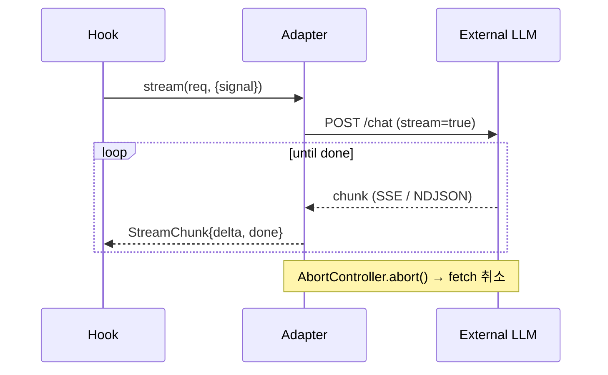

# 03. API 프리뷰 — `@org/ai-react`

> **한 줄 요약**: 라이브러리 API는 두 축 — (1) **Public API** (사용자가 import하는 컴포넌트/Hook props·시그니처), (2) **External API** (어댑터가 OpenAI/Ollama와 통신하는 프로토콜).
>
> **상태**: 초안(Draft) — `_workspace/02_api_spec.md`로 승격 예정
>
> **참조**: [02_architecture_preview](./02_architecture_preview.md) · [04_db_preview](./04_db_preview.md)

---

## A. Public API (라이브러리 사용자가 사용)

### A.1 `<AiProvider>` — 컨텍스트 주입

```ts
type AiProviderProps =
  | { engine: 'openai'; config: OpenAIConfig; storage?: StorageAdapter; queryClient?: QueryClient; children: ReactNode }
  | { engine: 'local';  config: LocalConfig;  storage?: StorageAdapter; queryClient?: QueryClient; children: ReactNode };

interface OpenAIConfig {
  apiKey?: string;                    // direct call 모드에서 필수
  proxyUrl?: string;                  // 권장: BYO backend로 키 위임
  dangerouslyAllowBrowser?: boolean;  // direct 모드 명시적 opt-in
  model?: string;                     // default: 'gpt-4o-mini'
  temperature?: number;               // default: 0.7
  maxTokens?: number;
  headers?: Record<string, string>;   // proxy 인증 등에 사용
}

interface LocalConfig {
  baseUrl?: string;                   // default: 'http://localhost:11434'
  model: string;                      // 'llama3', 'qwen2.5', etc.
  temperature?: number;
  keepAlive?: string;                 // Ollama keep_alive
}
```

**동작**
- `proxyUrl`도 `apiKey`도 없으면 dev 콘솔 경고 + production throw.
- `apiKey` 있고 `proxyUrl` 없고 `dangerouslyAllowBrowser !== true` → 런타임 에러 throw.
- `queryClient` 미주입 시 내부에서 기본 클라이언트 생성.

### A.2 `<AiChat>` — 채팅 UI

```ts
interface AiChatProps {
  // 데이터
  initialMessages?: Message[];
  systemPrompt?: string;

  // 영속화
  sessionId?: string;                 // default: 'default'. localStorage key 분리용
  persist?: boolean;                  // default: true

  // UX
  placeholder?: string;
  emptyState?: ReactNode;
  renderMessage?: (m: Message) => ReactNode;  // render-prop 슬롯
  composerSlot?: ReactNode;            // 커스텀 입력창

  // 콜백
  onMessageSent?: (m: Message) => void;
  onComplete?: (m: Message) => void;
  onError?: (e: Error) => void;

  // 스타일링
  className?: string;
  classNames?: {
    root?: string;
    list?: string;
    message?: string;
    composer?: string;
  };

  // 한도
  maxMessages?: number;                // 영속화 한도. default: 100
}
```

**Data attributes (스타일 hook)**
- `[data-state="idle" | "streaming" | "error"]`
- `[data-role="user" | "assistant" | "system"]` on message

### A.3 `<AiSummaryButton>`

```ts
interface AiSummaryButtonProps {
  input: string;
  prompt?: string;                     // default: '다음 텍스트를 3줄로 요약해줘.'
  trigger?: 'click' | 'hover' | 'manual';
  render?: (s: { result: string; loading: boolean; error?: Error }) => ReactNode;
  onResult?: (result: string) => void;
  className?: string;
  children?: ReactNode;                // 버튼 라벨
}
```

### A.4 `<AiRewriteButton>` (P1)

```ts
interface AiRewriteButtonProps {
  input: string;
  tone?: 'formal' | 'casual' | 'concise' | 'friendly' | 'professional';
  customPrompt?: string;
  onResult?: (rewritten: string) => void;
  render?: (s: { result?: string; loading: boolean; error?: Error }) => ReactNode;
}
```

### A.5 `<AiFileQaPanel>` (P1)

```ts
interface AiFileQaPanelProps {
  accept?: string;                     // default: '.pdf,.txt'
  maxFileSize?: number;                // bytes, default: 4MB
  retrieval?: 'client-embedding' | 'chunk-and-prompt';  // [TBD]
  onUpload?: (doc: Document) => void;
  onAnswer?: (q: string, a: string) => void;
}
```

### A.6 Hooks

```ts
// 채팅 상태/제어
function useAiChat(opts?: {
  sessionId?: string;
  systemPrompt?: string;
  initialMessages?: Message[];
  onChunk?: (c: StreamChunk) => void;
  onComplete?: (m: Message) => void;
}): {
  messages: Message[];
  send: (text: string) => Promise<void>;
  cancel: () => void;
  clear: () => void;
  isStreaming: boolean;
  error: Error | null;
};

// 단일 요약
function useAiSummary(opts?: { prompt?: string }): {
  summarize: (input: string) => Promise<string>;
  loading: boolean;
  error: Error | null;
  result: string | null;
};

// (P1)
function useAiRewrite(): { rewrite: (text: string, tone?: Tone) => Promise<string>; ...};
```

### A.7 Storage Adapter (Plug-in)

```ts
interface StorageAdapter {
  get<T>(key: string): Promise<T | null>;
  set<T>(key: string, value: T): Promise<void>;
  remove(key: string): Promise<void>;
}

// 기본 export
export const localStorageAdapter: StorageAdapter;
export const memoryStorageAdapter: StorageAdapter;
```

### A.8 패키지 Exports

```jsonc
// package.json
{
  "exports": {
    ".": {
      "types": "./dist/index.d.ts",
      "import": "./dist/index.mjs",
      "require": "./dist/index.cjs"
    },
    "./preset": {
      "types": "./dist/preset.d.ts",
      "import": "./dist/preset.mjs",
      "require": "./dist/preset.cjs"
    }
  },
  "sideEffects": false
}
```

**Public exports (배럴)**
```ts
// src/index.ts
export { AiProvider } from './provider/AiProvider';
export { AiChat } from './components/AiChat';
export { AiSummaryButton } from './components/AiSummaryButton';
export { AiRewriteButton } from './components/AiRewriteButton';      // P1
export { AiFileQaPanel } from './components/AiFileQaPanel';          // P1
export { useAiChat, useAiSummary, useAiRewrite } from './hooks';
export { OpenAIAdapter, LocalModelAdapter } from './adapters';
export { localStorageAdapter, memoryStorageAdapter } from './storage';
export type { Message, StreamChunk, BaseResponse, Adapter, StorageAdapter } from './types';
```

---

## B. External API (어댑터 ↔ 외부 LLM)

### B.1 어댑터 공통 인터페이스

```ts
interface ChatRequest {
  messages: Message[];
  systemPrompt?: string;
  model?: string;
  temperature?: number;
  maxTokens?: number;
  metadata?: Record<string, unknown>;
}

interface BaseAdapter {
  readonly id: string;                                 // 'openai' | 'local' | ...
  chat(req: ChatRequest, opts?: { signal?: AbortSignal }): Promise<BaseResponse>;
  stream(req: ChatRequest, opts?: { signal?: AbortSignal }): AsyncIterable<StreamChunk>;
}
```

### B.2 OpenAI 어댑터 — Chat Completions (Streaming)

**Endpoint (direct mode)**: `POST https://api.openai.com/v1/chat/completions`
**Endpoint (proxy mode)**: `POST {proxyUrl}` (사용자 백엔드가 같은 형태로 받아 위임)

**Request Body**
```jsonc
{
  "model": "gpt-4o-mini",
  "messages": [
    { "role": "system", "content": "..." },
    { "role": "user",   "content": "안녕" }
  ],
  "temperature": 0.7,
  "stream": true
}
```

**Headers**
- Direct: `Authorization: Bearer {apiKey}`
- Proxy: 라이브러리는 `Authorization` 미설정 (사용자 backend가 주입). `headers` prop으로 사용자 인증 추가 가능.

**SSE Response (한 chunk 예)**
```
data: {"id":"chatcmpl-...","choices":[{"index":0,"delta":{"content":"안"},"finish_reason":null}]}

data: {"id":"chatcmpl-...","choices":[{"index":0,"delta":{"content":"녕"},"finish_reason":null}]}

data: [DONE]
```

**정규화 규칙 (어댑터 내부)**
- 각 SSE event → `StreamChunk { delta: choices[0].delta.content, done: false }`
- `[DONE]` → `StreamChunk { delta: '', done: true, finishReason: 'stop' }`
- HTTP 4xx/5xx → 본문 파싱 후 `Error` throw (status code 포함).
- HTTP 429 → exponential backoff 1회 (jitter 250~500ms) 후 재throw.

### B.3 LocalModelAdapter — Ollama Chat (Streaming)

**Endpoint**: `POST {baseUrl}/api/chat`  (default `http://localhost:11434/api/chat`)

**Request Body**
```jsonc
{
  "model": "llama3",
  "messages": [{ "role": "user", "content": "안녕" }],
  "stream": true,
  "options": { "temperature": 0.7 },
  "keep_alive": "5m"
}
```

**NDJSON Response (라인 단위)**
```jsonl
{"model":"llama3","created_at":"...","message":{"role":"assistant","content":"안"},"done":false}
{"model":"llama3","created_at":"...","message":{"role":"assistant","content":"녕"},"done":false}
{"model":"llama3","created_at":"...","done":true,"total_duration":123456789,"eval_count":10}
```

**정규화 규칙**
- 각 라인 JSON 파싱 → `StreamChunk { delta: message.content, done }`.
- `done: true`에서 `usage` 필드를 `BaseResponse.usage`로 매핑(`promptTokens` 미제공 → `prompt_eval_count` 사용).
- 연결 실패(ECONNREFUSED) → "Ollama가 실행 중인지 확인하세요(`ollama serve`)" 메시지.

### B.4 통신 시퀀스 (요약)



### B.5 에러 매핑

| 외부 상황 | 라이브러리 Error 타입 | 메시지 |
|----------|---------------------|--------|
| HTTP 401 (OpenAI) | `AuthError` | "Invalid API key. Check apiKey or proxyUrl." |
| HTTP 429 | `RateLimitError` | 1회 재시도 후 throw, `retryAfter` 필드 포함 |
| HTTP 5xx | `UpstreamError` | status·body 포함 |
| Network/CORS | `NetworkError` | direct 모드에서 CORS 가이드 추가 |
| AbortError | (전파) | `cancel()` 호출 시 정상 종료로 간주 |
| Ollama ECONNREFUSED | `LocalEngineUnavailable` | "ollama serve" 가이드 |

---

## C. 호환성·버전 정책

- 0.x: minor에서 breaking 가능. CHANGELOG에 명시.
- 1.0 이후 SemVer 엄격.
- `Message`/`StreamChunk` 타입은 1.0 동결 후 union 확장만 허용(필드 제거 금지).

---

## D. Open Questions

- [TBD: OpenAI Responses API(`/v1/responses`) 마이그레이션 시점]
- [TBD: 멀티모달 콘텐츠(`content: ContentPart[]`)를 0.1.0 타입에 미리 포함할지]
- [TBD: `proxyUrl`이 OpenAI 호환 스키마를 따른다고 가정할지, 자체 envelope 정의할지]
