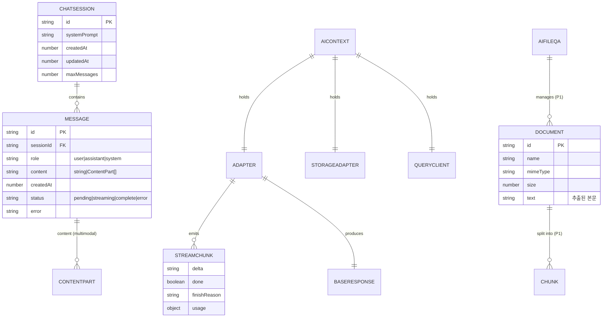
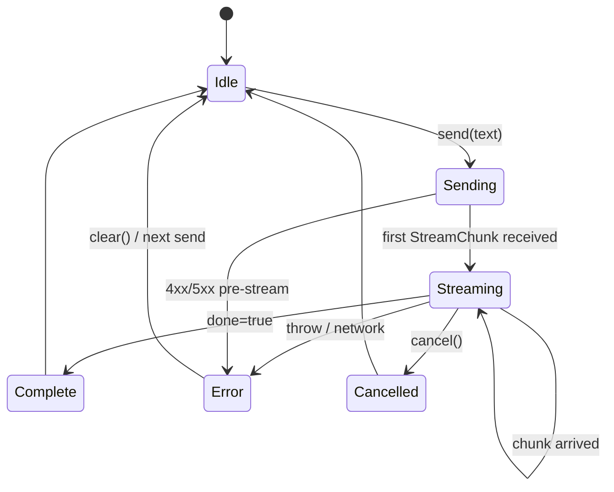

# 04. 내부 데이터 모델 / TypeScript 타입 — `@org/ai-react`

> **한 줄 요약**: 이 라이브러리에는 DB가 없다. 대신 **(a) 도메인 타입**(Message, StreamChunk, BaseResponse 등), **(b) 클라이언트 상태 트리**(AiContext, useAiChat state), **(c) 영속화 스키마**(localStorage 직렬화 포맷)를 정의한다.
>
> **상태**: 초안(Draft) — `_workspace/03_db_schema.md`로 승격 예정. (제목은 유지하되 내용은 "내부 데이터 모델"로 채움)
>
> **참조**: [02_architecture_preview](./02_architecture_preview.md) · [03_api_preview](./03_api_preview.md)

---

## 1. 도메인 엔티티 ER 도식

> ⚠️ 관계형 DB가 아니라 **메모리/localStorage 상의 객체 그래프** 모델임.



---

## 2. 핵심 TypeScript 타입 정의

### 2.1 `Message` & `ContentPart`

```ts
export type Role = 'user' | 'assistant' | 'system';

export type ContentPart =
  | { type: 'text'; text: string }
  | { type: 'image'; url: string; mimeType?: string }            // P2 (Vision)
  | { type: 'file'; name: string; mimeType: string; size: number }; // P1 (FileQa)

export interface Message {
  id: string;                    // ULID/UUID
  role: Role;
  content: string | ContentPart[]; // 0.1은 string 위주, 향후 union 활용
  createdAt: number;             // epoch ms
  status?: 'pending' | 'streaming' | 'complete' | 'error';
  error?: string;
  metadata?: Record<string, unknown>;
}
```

### 2.2 `StreamChunk` & `BaseResponse`

```ts
export interface StreamChunk {
  delta: string;                 // 누적이 아닌 증분 텍스트
  done: boolean;
  finishReason?: 'stop' | 'length' | 'content_filter' | 'tool_calls';
  usage?: TokenUsage;            // done=true일 때만 포함
  raw?: unknown;                 // 디버깅용 원본 (production에서 strip 가능)
}

export interface BaseResponse {
  id: string;
  message: Message;              // 최종 assistant 메시지
  finishReason?: StreamChunk['finishReason'];
  usage?: TokenUsage;
  model?: string;
}

export interface TokenUsage {
  promptTokens?: number;
  completionTokens?: number;
  totalTokens?: number;
}
```

### 2.3 `Adapter` 계약

```ts
export interface Adapter {
  readonly id: string;
  chat(req: ChatRequest, opts?: { signal?: AbortSignal }): Promise<BaseResponse>;
  stream(req: ChatRequest, opts?: { signal?: AbortSignal }): AsyncIterable<StreamChunk>;
}

export interface ChatRequest {
  messages: Message[];
  systemPrompt?: string;
  model?: string;
  temperature?: number;
  maxTokens?: number;
  metadata?: Record<string, unknown>;
}
```

### 2.4 `Engine` 디스크리미네이터

```ts
export type Engine = 'openai' | 'local';

export type EngineConfig =
  | { engine: 'openai'; config: OpenAIConfig }
  | { engine: 'local';  config: LocalConfig };
```

### 2.5 `ChatSession` (영속화 단위)

```ts
export interface ChatSession {
  id: string;                    // sessionId prop과 1:1
  systemPrompt?: string;
  messages: Message[];
  createdAt: number;
  updatedAt: number;
  schemaVersion: number;         // 마이그레이션 키
}
```

### 2.6 `Document` (P1, FileQA용)

```ts
export interface Document {
  id: string;
  name: string;
  mimeType: 'application/pdf' | 'text/plain' | string;
  size: number;
  text: string;                  // 추출된 본문 (PDF는 pdf.js 등으로)
  chunks?: Chunk[];              // 검색 단위
}

export interface Chunk {
  id: string;
  documentId: string;
  text: string;
  embedding?: number[];          // [TBD: client-embedding 채택 시]
  start: number;                 // 원본 텍스트 offset
  end: number;
}
```

---

## 3. React 상태 트리

### 3.1 `AiContext` (Provider value)

```ts
export interface AiContextValue {
  engine: Engine;
  adapter: Adapter;
  storage: StorageAdapter;
  queryClient: QueryClient;
  config: OpenAIConfig | LocalConfig;
  // 디버그/관측
  _debug?: { lastError?: Error; adapterId: string };
}
```

### 3.2 `useAiChat` 내부 상태

```ts
interface UseAiChatState {
  messages: Message[];
  isStreaming: boolean;
  error: Error | null;
  abortController: AbortController | null;
  // TanStack Query 관리
  // streamMutation: useMutation<...>
}
```



---

## 4. 영속화 스키마 (localStorage)

### 4.1 키 네이밍

| 키 | 값 타입 | 설명 |
|----|--------|------|
| `aireact:v1:session:{sessionId}` | `ChatSession` (JSON) | 세션별 메시지 |
| `aireact:v1:meta` | `{ schemaVersion: 1, sessions: string[] }` | 인덱스 |
| `aireact:v1:doc:{docId}` | `Document` (P1) | 업로드 문서 |

### 4.2 직렬화 규칙

- `Message.content`가 `ContentPart[]`인 경우 그대로 JSON 직렬화. 바이너리는 저장 안 함(이미지 url만).
- `Document.text`는 길이 제한(예: 1MB) 초과 시 잘라서 저장 + 경고 로그.
- 마이그레이션: `schemaVersion` 비교 → 다르면 best-effort 변환 후 백업 키(`aireact:v1:backup:...`)로 보존.

### 4.3 SSR 안전성

```ts
const safeLocalStorage: StorageAdapter = {
  async get(k) { if (typeof window === 'undefined') return null; ... },
  async set(k, v) { if (typeof window === 'undefined') return; ... },
  async remove(k) { if (typeof window === 'undefined') return; ... },
};
```

---

## 5. 인덱싱·성능 메모

DB가 없으므로 "인덱스" 대신 다음을 보장:

| 항목 | 전략 |
|------|------|
| 메시지 추가 | `messages.push()` O(1), 영속화는 throttled write (500ms debounce) |
| 큰 세션 자르기 | `maxMessages` 초과 시 앞에서 N개 잘라 보관 |
| 렌더 최적화 | 메시지 리스트는 `key=Message.id`, virtualization은 0.2.0 [TBD] |
| 스트리밍 중 리렌더 | last message만 mutable로 업데이트(전체 배열 새 참조 1번/16ms 미만) |

---

## 6. 검증·불변식

- `Message.id`는 단조 증가(ULID 권장). 동일 sessionId 내 unique.
- `role === 'system'` 메시지는 세션당 최대 1개.
- `status === 'streaming'` 메시지는 sessionId당 최대 1개(동시 다중 streaming 금지).
- `ChatSession.schemaVersion === 1` 외 값은 마이그레이션 진입.

---

## 7. Open Questions

- [TBD: 토큰 사용량(`TokenUsage`)을 messages metadata로 영속화할지, 메모리만 유지할지]
- [TBD: 클라이언트 임베딩 시 `Chunk.embedding`을 IndexedDB로 분리(localStorage 용량 한계)]
- [TBD: 멀티 세션 UI 기본 제공 여부 — 0.1.0은 단일 세션만]
- [TBD: `Message.content`를 ContentPart[] 단일화 vs string 호환 유지]
