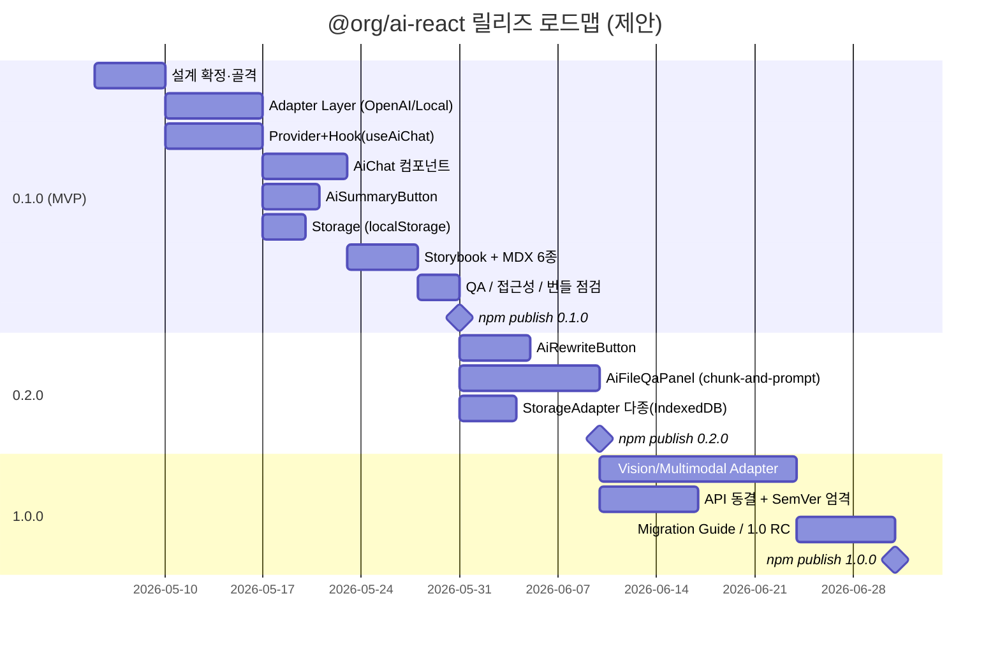

# 06. 마일스톤 & 백로그 — `@org/ai-react`

> **한 줄 요약**: 0.1.0(MVP·P0 6종 + Storybook + npm publish) → 0.2.0(P1 컴포넌트, RAG 기초) → 1.0.0(API 동결, Vision/모달리티 확장).
>
> **상태**: 초안(Draft) — `_workspace/`에서 일정·담당 확정.

---

## 1. 릴리즈 로드맵

> 일정은 제안값(상대). `_workspace/`에서 절대 날짜·담당자 확정.

---

## 2. 0.1.0 — MVP

### 2.1 Scope (반드시 포함)
| 영역 | 항목 | 수락 기준 |
|------|------|----------|
| Provider | `<AiProvider>` engine 디스크리미네이터, queryClient/storage 주입 | TS strict 통과, Provider 외부 사용 시 throw |
| Adapter | `OpenAIAdapter` (proxy + direct), `LocalModelAdapter` (Ollama) | SSE/NDJSON 정규화, 429 1회 재시도 |
| Hook | `useAiChat`, `useAiSummary` | 메시지·send·cancel·isStreaming·error 노출 |
| Components | `<AiChat>`, `<AiSummaryButton>` | data-attribute hook + className 슬롯, 접근성 통과 |
| Storage | `localStorageAdapter`, `memoryStorageAdapter` | SSR 안전, schemaVersion=1, debounced write |
| Build | Vite library mode (ESM+CJS+dts), `sideEffects:false`, `exports` map | `npm pack` 산출물 검증 |
| Docs | Storybook 6종 + Quick Start MDX | 컴포넌트별 default/streaming/error 스토리 |
| Quality | Vitest 단위테스트, MSW SSE 모킹, size-limit | 핵심 어댑터/Hook 커버리지 ≥ 80% |
| Publish | npm publish (`@org/ai-react@0.1.0`) | dry-run + provenance, MIT 라이선스 |

### 2.2 Out of Scope (0.1.0)
- AiRewriteButton, AiFileQaPanel
- Vision 어댑터, 마크다운 렌더러 내장
- 다국어 i18n
- 멀티 세션 UI

### 2.3 Definition of Done
- [ ] `npm install @org/ai-react` → 5분 안에 AiChat 동작 데모 화면
- [ ] Storybook 정적 빌드가 GitHub Pages/Vercel에 배포
- [ ] CI: lint / type-check / test / size-limit / pack-smoke 모두 green
- [ ] CHANGELOG.md, README.md, LICENSE(MIT), CONTRIBUTING.md 존재

---

## 3. 0.2.0 — P1 Components

| 영역 | 항목 | 비고 |
|------|------|------|
| Component | `<AiRewriteButton>` (tone preset + customPrompt) | render-prop 슬롯 |
| Component | `<AiFileQaPanel>` (PDF/TXT) | retrieval 전략은 `chunk-and-prompt` 우선, 임베딩은 [TBD] |
| Storage | `IndexedDBStorageAdapter` (Document text 저장) | 4MB 초과 대응 |
| Adapter | OpenAI 호출에 `system` 메시지 시 헤더 강화 | proxy envelope 가이드 보강 |
| Docs | RAG 패턴 MDX, Proxy backend 예제 (Express/Next.js Route) | |

**DoD**: Document 4MB 업로드→QA 종단테스트 1개, RAG 패턴 MDX 1개, breaking change CHANGELOG.

---

## 4. 1.0.0 — API 동결 & 멀티모달

| 영역 | 항목 | 비고 |
|------|------|------|
| Adapter | Vision/멀티모달(`ContentPart[]` 정식 채택) | 신규 `<AiImageAnalyzer>` |
| API 정책 | SemVer 엄격, deprecate 정책 문서화 | 0.x 누적 deprecate 정리 |
| Perf | 메시지 리스트 virtualization 옵션 | react-virtual 등 검토 |
| Eco | 추가 어댑터 가이드 (Claude/HF/OpenRouter) | 기여 가이드 정비 |
| Docs | 1.0 마이그레이션 가이드 | breaking 항목 정리 |

**DoD**: `Message`/`StreamChunk` 타입 동결 선언, 1.0 RC → 1.0 안정.

---

## 5. 백로그 (칸반)

### Now (0.1.0 진행)
- [ ] `BaseAdapter` 인터페이스 + 정규화 유틸 (`parseSSE`, `parseNdjson`)
- [ ] `OpenAIAdapter` direct/proxy 분기, `dangerouslyAllowBrowser` guard
- [ ] `LocalModelAdapter` (Ollama `/api/chat`) NDJSON 파싱
- [ ] `AiProvider` + `AiContext` + queryClient 자동 생성
- [ ] `useAiChat` (TanStack Query mutation + AbortController)
- [ ] `<AiChat>` 헤드리스 골격 + a11y(`role="log"`, `aria-live`)
- [ ] `<AiSummaryButton>` + Popover 슬롯
- [ ] `localStorageAdapter` (SSR-safe, debounced)
- [ ] Storybook setup + MSW SSE handler
- [ ] Vite library config (`vite-plugin-dts`, exports map)
- [ ] CI workflows (test/build/size-limit/pack-smoke)

### Next (0.2.0)
- [ ] `<AiRewriteButton>` + tone presets
- [ ] PDF.js 통합(`AiFileQaPanel` 텍스트 추출)
- [ ] chunk-and-prompt RAG 기본 구현
- [ ] `IndexedDBStorageAdapter`
- [ ] Proxy backend 예제(Express/Next.js Route Handler)
- [ ] OpenAI Responses API 호환 검토

### Later (1.0.0+)
- [ ] Vision 어댑터 + `<AiImageAnalyzer>`
- [ ] Claude 어댑터(샘플), HuggingFace 어댑터(샘플)
- [ ] 메시지 리스트 virtualization
- [ ] i18n 시스템(label override)
- [ ] React Server Components(RSC) 호환 가이드

---

## 6. 리스크 & 완화

| 리스크 | 영향 | 완화 |
|--------|------|------|
| OpenAI API 변경(Responses API 마이그레이션 압박) | High | 어댑터 격리, 0.x에서 minor breaking 허용 명시 |
| 번들 크기 팽창(마크다운/PDF.js 내장 욕구) | Medium | 옵셔널 deep import, peer/optional dep로 분리 |
| 직접 호출 모드 키 노출 사고 | Critical | `dangerouslyAllowBrowser` 강제 + dev 콘솔/타입 경고 다층 |
| Ollama 환경 차이(CORS, port) | Medium | 가이드 문서화, 명시적 에러 메시지 |
| RAG 품질 기대치(0.2.0) | Medium | "기초 RAG"임을 README/MDX에 명시, 외부 백엔드 위임 옵션 안내 |
| TanStack Query peer 강제로 인한 마찰 | Low | 사용자 환경에 이미 흔함, 미설치 시 친절한 에러 |

---

## 7. 측정·관측

- npm 다운로드 추이(weekly), GitHub stars/issues, Storybook 페이지 view.
- 0.1.0 첫 4주 안에 사용자 issue 5건 이상 수집 → 0.2.0 priority 재조정.

---

## 8. Open Questions

- [TBD: 0.1.0 → 0.2.0 사이 patch(0.1.x)에서 수용할 변경 범위]
- [TBD: provenance 서명, GitHub Actions OIDC publish 시점]
- [TBD: 코드 오너십(코드오너 파일) 도입 여부]
